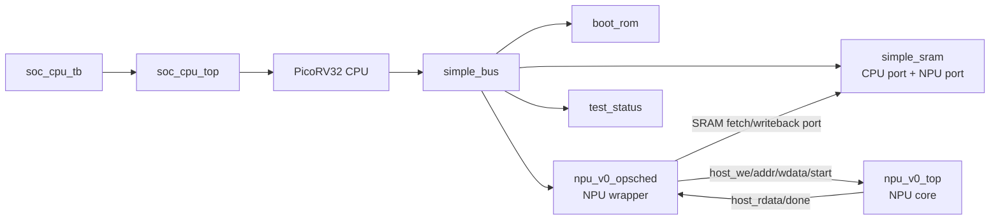

# NPU SoC Architecture

[TOC]

本文档描述当前 `npu_v0` SoC 的基本架构、NPU 计算逻辑、CPU 软件交互逻辑和
后续演进边界。它是“当前系统架构怎么工作”的入口；代码路径和逐文件走读见
`docs/code_structure_review.md`。

## 1. 当前目标

当前目标不是一次性做复杂 NPU，而是先建立一个小 SoC，把 CPU、SRAM、NPU
wrapper、NPU core、firmware、compiler artifacts 串成真实软硬件闭环。

当前闭环支持：

- `matmul`
- `softmax`
- `matmul -> softmax` 的验证流

当前最重要的架构原则：

- CPU 只通过 memory-mapped register 控制 NPU wrapper。
- tensor 数据、program stream、descriptor 进入 SRAM。
- NPU wrapper 根据 descriptor 从 SRAM fetch 数据和 program。
- NPU core 仍保持简单，先复用现有 host interface 和内部执行状态机。
- wrapper 是 SoC 和 NPU core 之间的边界，后续可以逐步演进为更真实的
  scheduler/DMA/command queue。

## 2. 顶层 SoC 框架

当前 CPU-controlled SoC 的硬件框架是：



`soc_cpu_tb` 只负责仿真环境：

- 产生 `clk`；
- 拉住并释放 `rst_n`；
- 观察 `sim_status` 和 `cpu_trap`；
- 不直接操作 NPU wrapper。

`soc_cpu_top` 是 SoC 顶层，实例化：

- PicoRV32 CPU wrapper；
- local memory bus；
- boot ROM；
- simple SRAM；
- NPU wrapper；
- test status register。

## 3. Memory Map

SoC memory map 的 source of truth 是：

```text
arch/configs/soc_v0.jsonc
```

当前地址图：

| Region | Address range | 用途 |
| --- | --- | --- |
| Boot ROM | `0x0000_0000` - `0x0000_7fff` | 当前仿真完整 firmware 镜像 |
| SRAM | `0x0002_0000` - `0x0003_ffff` | stack、locals、descriptor、tensor/program buffers |
| NPU wrapper | `0x1000_0000` - `0x1000_0fff` | NPU 控制寄存器和 legacy debug windows |
| UART | `0x2000_0000` - `0x2000_0fff` | 预留 |
| Test status | `0x3000_0000` - `0x3000_000f` | 仿真 pass/fail |

`make soc-spec` 从该 spec 生成：

```text
build/soc/soc_v0_addr.svh
build/soc/soc_v0_addr.h
build/soc/soc_v0.ld
```

注意当前 boot ROM 是 bring-up 简化模型：`soc_cpu_smoke.hex` 包含完整 smoke
firmware，包括 `start.S`、NPU driver、`main()` 和测试数据。真实 SoC 后续更可能
是小 boot ROM 从 flash 或外部存储加载用户程序到 SRAM/DRAM 后再跳转。

## 4. NPU Wrapper Register Model

NPU wrapper register map 的 source of truth 是：

```text
arch/configs/npu_wrapper_v0.jsonc
```

生成物：

```text
build/npu_wrapper/npu_v0_regs.svh
build/npu_wrapper/npu_v0_regs.h
```

当前关键寄存器：

| Offset | Name | 作用 |
| --- | --- | --- |
| `0x000` | `CTRL` | bit 0 write-1-to-start |
| `0x004` | `STATUS` | bit 0 done, bit 1 busy, bit 2 idle |
| `0x008` | `VERSION` | wrapper version |
| `0x00c` | `IRQ_ENABLE` | interrupt enable, reserved for later |
| `0x010` | `IRQ_STATUS` | interrupt status, reserved for later |
| `0x020` | `DESC_ADDR` | SRAM 中 `npu_job_desc` 的地址 |

旧的 A/B/C/X/Y/program windows 还保留，用于 `soc-sim` legacy wrapper smoke。
但 CPU firmware-controlled 路径已经转向 descriptor/SRAM launch，不再依赖逐
word MMIO 数据窗口。

## 5. CPU-NPU 交互协议

当前 `cpu-soc-sim` 使用 descriptor/SRAM 交互路径。

descriptor ABI 的 source of truth 也在 `arch/configs/soc_v0.jsonc` 的
`abi.npu_job_desc` 中，因为它是 SoC 级 CPU firmware 与 NPU wrapper 的共享
契约。`make soc-spec` 会从这里生成：

```text
build/soc/soc_v0_addr.h    // C firmware 使用 soc_npu_job_desc_t 和 op id
build/soc/soc_v0_addr.svh  // RTL wrapper 使用字段 word offset 和 op id
```

当前生成出的 C layout 等价于：

```c
typedef struct {
    uint32_t op_type;        // 1 = matmul, 2 = softmax
    uint32_t program_addr;   // SRAM address of encoded NPU program stream
    uint32_t program_words;
    uint32_t input0_addr;    // SRAM address of A or X
    uint32_t input0_words;
    uint32_t input1_addr;    // SRAM address of B for matmul, 0 for softmax
    uint32_t input1_words;
    uint32_t output_addr;    // SRAM address of C or Y
    uint32_t output_words;
} soc_npu_job_desc_t;
```

CPU firmware 负责：

1. 在 SRAM 中准备 input tensor buffer。
2. 在 SRAM 中放置 NPU program stream。
3. 在 SRAM 中分配 output buffer。
4. 填写 `npu_job_desc`。
5. 写 `DESC_ADDR`。
6. 写 `CTRL.start`。
7. 轮询 `STATUS.done`。
8. 从 SRAM output buffer 读结果并校验。
9. 写 `test_status` 报告仿真 PASS/FAIL。

NPU wrapper 负责：

1. 读取 `DESC_ADDR` 指向的 descriptor。
2. 从 SRAM fetch program stream。
3. 从 SRAM fetch input tensor。
4. 通过当前 NPU core host interface 加载 core 内部 memory。
5. 给 NPU core 一个 cycle 的 `start_pulse`。
6. 等待 core `done`。
7. 读取 core output host window。
8. 写回 SRAM output buffer。
9. 设置 `STATUS.done`。

当前 wrapper FSM：

```text
DESC_READ
  -> DESC_FETCH_PROGRAM
  -> DESC_FETCH_INPUT0
  -> DESC_FETCH_INPUT1
  -> DESC_START_CORE
  -> DESC_WAIT_CORE
  -> DESC_WRITE_OUTPUT
  -> DESC_DONE
```

## 6. NPU Core 计算逻辑

当前 NPU core 是 `hw/npu_core/rtl/npu_v0_top.sv`，它不是复杂可扩展硬件，而是
Phase 0 的可验证计算核心。

内部主要存储：

| Storage | 用途 |
| --- | --- |
| `dram_a` | Matrix A input |
| `dram_b` | Matrix B input |
| `dram_c` | Matrix C output |
| `dram_x` | Softmax input |
| `dram_y` | Softmax output |
| `instr_mem` | encoded micro-op program |
| `spad_a/spad_b` | matmul scratchpad |
| `acc_buf` | matmul accumulator/output staging |
| `vec_buf` | vector/SFU staging |

核心状态机：

```text
ST_IDLE
  -> ST_FETCH
  -> ST_MATMUL when MATMUL uop is decoded
  -> ST_FETCH after matmul tile completes
  -> ST_DONE on HALT
```

当前 micro-op 子集：

| Uop | 作用 |
| --- | --- |
| `LOAD` | 把 input tensor 从 core-local dram 载入 scratch/vector buffer |
| `MATMUL` | 执行固定 tile 的矩阵乘 |
| `STORE` | 把 accumulator/vector output 写回 core-local dram |
| `VREDMAX` | softmax max reduction |
| `VSUB` | softmax subtract max |
| `VEXP` | softmax exp approximation |
| `VREDSUM` | softmax sum reduction |
| `VDIV` | softmax normalize |
| `HALT` | 结束 program |

Matmul 逻辑当前是固定 tile 的三层循环状态机，本质是：

```text
for i in M:
  for j in N:
    acc = 0
    for k in K:
      acc += A[i, k] * B[k, j]
    C[i, j] = acc
```

因此当前 8x8x8 matmul 的 compute 部分会消耗约：

```text
8 * 8 * 8 = 512 MAC cycles
```

这不是现代 tensor/cube/MXU 风格矩阵单元的实现。当前 RTL 虽然在
`arch/configs/npu_v0.jsonc` 中记录了 Phase 0 逻辑 tile 和 `mac_lanes = 64`，
但手写 core 仍然是单 lane iterative MAC baseline。后续目标是把该路径替换为
parameterized systolic/tensor-array matmul engine。长期目标和分阶段计划见：

```text
docs/target_architecture.md
```

Softmax 逻辑当前是 vector pipeline 风格的 sequential task 组合：

```text
LOAD X
VREDMAX
VSUB
VEXP
VREDSUM
VDIV
STORE Y
HALT
```

## 7. Program/Compiler 边界

当前 program stream 由 host-side tooling 生成。`sw/tools/npu_phase0` 仍作为兼容
入口保留，但 graph lowering 和 uop encoding 已经开始拆到正式目录：

```text
sw/npu_core/operators/phase0_intrinsics.json
sw/tools/npu_compiler/phase0.py
sw/tools/npu_assembler/phase0.py
sw/tools/npu_phase0/compiler.py      // compatibility wrapper
sw/tools/npu_phase0/rtl_fixture.py   // fixture generation wrapper/user
```

当前分层含义是：

- `sw/tools`: graph compiler、operator lowering、assembler、simulator、
  fixture generator。
- `sw/npu_core/operators`: 以 NPU core ISA/intrinsic 为基础描述 matmul、softmax
  等算子实现，不放 CPU driver/runtime。当前 Phase 0 使用 JSON template 描述
  operator 到 ISA/uop 的 intent。
- `sw/tools/npu_compiler`: 把 graph/operator lowering 到 NPU ISA/uop stream。
- `sw/tools/npu_assembler`: 把 ISA/uop stream 编码成 NPU core 需要的 32-bit
  program words。
- `sw/npu_core/programs`: 当某些固定 program stream 成为设计源码或 reference
  artifact 时放这里。
- `sw/soc_cpu`: CPU firmware、NPU driver、runtime、test apps。

当前 smoke firmware 仍然通过 generated header 获取 program words，但语义已经
调整为：program stream 是 NPU compiler/assembler 的产物，CPU firmware 只是把
它放到 SRAM 并通过 descriptor 交给 NPU wrapper。

## 8. Verification Loops

主要验证入口：

| Command | 覆盖内容 |
| --- | --- |
| `make validate-arch` | NPU architecture spec 基本合法性 |
| `make demo` | graph compile + Python simulator + golden |
| `make npu-core-sim` | 单独 NPU core RTL fixture |
| `make soc-sim` | legacy wrapper-window SoC path |
| `make cpu-soc-sim` | PicoRV32 firmware + descriptor/SRAM path |
| `make perf-report` | CPU-controlled SoC sim + cycle JSON/HTML performance report |
| `make test` | Python unit tests + 可用时运行 RTL/SoC sims |

当前最重要的闭环是：

```text
graph/input fixture
  -> NPU compiler/assembler emits program words
  -> firmware stages data/program/descriptor in SRAM
  -> CPU writes DESC_ADDR and CTRL.start
  -> wrapper fetches and runs NPU core
  -> wrapper writes output to SRAM
  -> CPU checks output
  -> test_status reports PASS/FAIL
```

当前 cycle 级性能报告入口：

```text
make perf-report
```

生成：

```text
build/perf/cpu_soc_perf.log
build/perf/perf.json
build/perf/perf_report.html
```

`soc_cpu_tb` 会按 NPU job 输出 `PERF_JOB` JSON line。当前 HTML report 已包含
cycle timeline：横轴是 cycle 时间，纵轴是 `CPU firmware`、`NPU wrapper`、
`NPU core`，实色块表示 active work，斜纹块表示 wait/blocked。当前统计 wrapper
的 descriptor/program/input/core/output 阶段，以及 core 的 fetch/matmul/done
阶段。详细现状、限制和扩展点见：

```text
sw/tools/perf/README.md
```

## 9. Current Limitations

当前仍然是最小可验证架构，不是完整 NPU SoC：

- NPU wrapper 的 SRAM fetch 是简单第二端口模型，不是完整 DMA/crossbar。
- descriptor ABI 已经收敛到 SoC spec，但字段仍只覆盖当前 matmul/softmax smoke。
- NPU core 仍然使用内部 host memory，不是真正 streaming datapath。
- program stream 仍主要由 Phase 0 fixture/tooling 生成，尚未把 operator 模板、
  compiler lowering 和 assembler 完整拆到正式目录。
- boot ROM 仍加载完整 firmware image，没有 flash loader。
- IRQ、performance counter、错误码、timeout、command queue 还未完善。

这些限制是有意保留的。当前优先级是先固定 CPU/NPU 交互协议，再逐步替换内部
实现。
