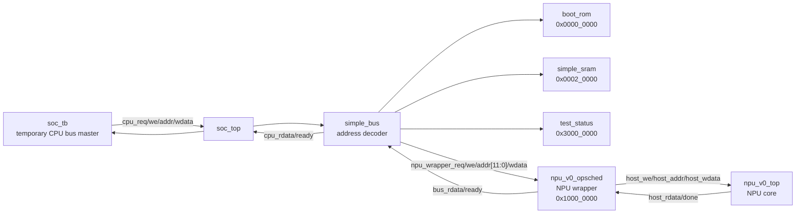
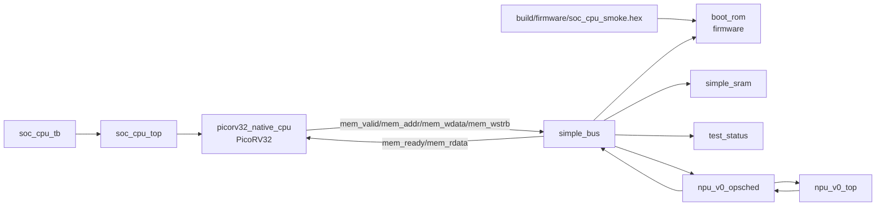
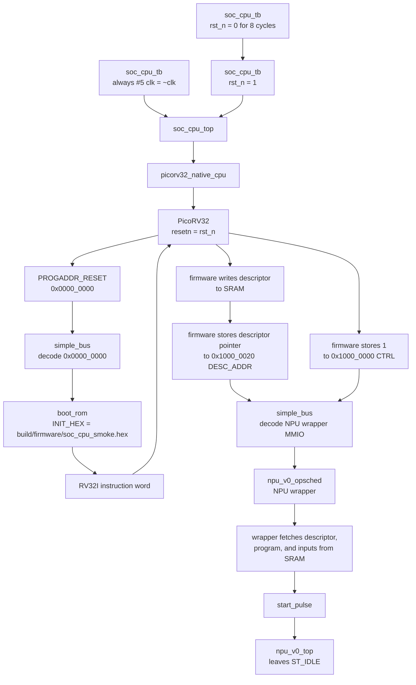
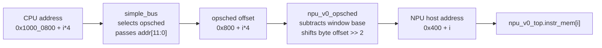

# Code Structure Review

This document is the current repository map for code review. It should stay
aligned with real paths whenever module boundaries or verification entry points
move.

For the higher-level NPU/SoC architecture, compute model, and CPU/NPU launch
protocol, start with `docs/architecture.md`. This file focuses on code
structure and review details.

[TOC]

## Top-Level Layout

```text
arch/                 architecture contracts
hw/                   synthesizable and simulation hardware
  soc/                SoC top, bus, memories, debug, later CPU integration
  npu_wrapper/        CPU-visible NPU wrapper and register interface
  npu_core/           NPU core RTL and core-level testbench
sw/                   software split by execution location
  soc_cpu/            firmware, NPU-wrapper driver, CPU-side runtime
  npu_core/           programs or operator code consumed by the NPU core
  tools/              host-side compilers, assemblers, simulators, fixtures
test/                 graph/input data and top-level verification tests
docs/                 active docs, journal, work rules, bring-up plans
build/                generated artifacts only
```

Historical documents that are no longer the current entry point live under
`docs/archive`.

## Current Source Of Truth

The architecture contract is:

```text
arch/configs/npu_v0.jsonc
```

It currently defines the Phase 0 NPU parameters, ISA instructions, binary
encoding fields, tensor IDs, buffer IDs, RTL tile sizes, and verification
tolerances. Compiler/tooling, fixture generation, RTL include files, and tests
should consume generated metadata from this contract instead of retyping the
same facts.

The SoC-level memory map and CPU boot contract are:

```text
arch/configs/soc_v0.jsonc
```

This file owns SoC base addresses, region sizes, and the CPU reset vector.
`make soc-spec` generates:

```text
build/soc/soc_v0_addr.svh
```

RTL and SoC testbenches include that generated file instead of retyping SoC
base addresses.

`make soc-spec` also generates the firmware-facing C header:

```text
build/soc/soc_v0_addr.h
```

Current SoC memory map:

| Region | Address range | Owner |
| --- | --- | --- |
| Boot ROM | `0x0000_0000` - `0x0000_7fff` | CPU reset/firmware image |
| SRAM | `0x0002_0000` - `0x0003_ffff` | CPU data/stack/temp memory |
| NPU wrapper | `0x1000_0000` - `0x1000_0fff` | CPU-visible NPU control/data/program windows |
| UART | `0x2000_0000` - `0x2000_0fff` | Reserved debug UART window |
| Test status | `0x3000_0000` - `0x3000_000f` | Simulation pass/fail register |

NPU-wrapper internal offsets, such as `CTRL`, `STATUS`, tensor windows, and
program window, are owned by:

```text
arch/configs/npu_wrapper_v0.jsonc
```

`make npu-wrapper-spec` generates both:

```text
build/npu_wrapper/npu_v0_regs.svh
build/npu_wrapper/npu_v0_regs.h
```

RTL/testbenches consume the generated `.svh`; firmware consumes the generated
`.h`. The checked-in `hw/npu_wrapper/rtl/npu_v0_regs.svh` remains only as a
local fallback when the generated include has not been emitted yet.

So the full address for `CTRL` is:

```text
SOC_NPU_WRAPPER_BASE + NPU_OPSCHED_CTRL = 0x1000_0000
```

## Tool Flow

Current host-side Python tooling remains in a compatibility package:

```text
sw/tools/npu_phase0/
```

The compiler/assembler split has started. New code should prefer these
ownership boundaries:

```text
sw/npu_core/operators/phase0_intrinsics.json  operator ISA/uop intent
sw/tools/npu_compiler/phase0.py               graph/operator -> uop stream
sw/tools/npu_assembler/phase0.py              uop stream -> 32-bit words
sw/tools/npu_phase0/compiler.py               compatibility import wrapper
sw/tools/npu_phase0/rtl_fixture.py            fixture generation using assembler
```

Important modules:

| File | Responsibility |
| --- | --- |
| `arch.py` | Load and validate `arch/configs/npu_v0.jsonc` |
| `compiler.py` | Compatibility wrapper for `npu_compiler.phase0.compile_graph` |
| `isa.py` | Validate micro-op legality |
| `simulator.py` | Execute compiler-emitted micro-ops in a Python model |
| `golden.py` | CPU reference models for supported ops |
| `rtl_fixture.py` | Emit deterministic RTL/SoC fixture hex and SV includes using `npu_assembler.phase0` |
| `cli.py` | Developer CLI entry points used by the Makefile |

The package is intentionally under `sw/tools` because it runs on the
development host. It is not NPU-core software.

## Hardware Layout

| Path | Responsibility |
| --- | --- |
| `hw/npu_core/rtl/npu_v0_top.sv` | Current hand-written NPU core |
| `hw/npu_core/tb/npu_v0_tb.sv` | Standalone NPU core RTL fixture test |
| `hw/npu_wrapper/rtl/npu_v0_opsched.sv` | CPU-visible NPU wrapper / scheduler |
| `arch/configs/npu_wrapper_v0.jsonc` | Wrapper register/window offset source of truth |
| `hw/soc/rtl/soc_top.sv` | Minimal SoC integration shell |
| `hw/soc/rtl/soc_cpu_top.sv` | PicoRV32-based SoC integration shell |
| `hw/soc/cpu/rtl/picorv32_native_cpu.sv` | PicoRV32 native-memory wrapper |
| `hw/soc/cpu/third_party/picorv32/picorv32.v` | Vendored PicoRV32 CPU IP |
| `hw/soc/rtl/bus/simple_bus.sv` | 32-bit local bus address decoder |
| `hw/soc/rtl/mem/*.sv` | ROM/SRAM wrappers |
| `hw/soc/rtl/debug/test_status.sv` | Simulation pass/fail status register |
| `hw/soc/tb/soc_tb.sv` | SoC MMIO smoke testbench |
| `hw/soc/tb/soc_cpu_tb.sv` | Firmware-controlled PicoRV32 SoC testbench |

There are now two SoC-level test styles:

- `soc-sim`: `soc_tb` directly drives the SoC bus as a temporary CPU-like bus
  master. This remains useful for isolating bus/wrapper behavior.
- `cpu-soc-sim`: PicoRV32 fetches firmware from boot ROM and performs the MMIO
  sequence itself.

## SoC Connection Diagram

Current `soc-sim` uses `soc_tb` as a temporary CPU bus master. The direct-bus
connection shape is:



The important boundary is:

| Boundary | Interface meaning |
| --- | --- |
| `soc_tb` -> `soc_top` | Temporary CPU-like local bus master |
| `soc_top` -> `simple_bus` | Same local bus, routed to SoC slaves |
| `simple_bus` -> `npu_v0_opsched` | Low 12 bits of the `0x1000_0000` NPU wrapper MMIO window |
| `npu_v0_opsched` -> `npu_v0_top` | Existing NPU core host interface plus `start/done` |

`soc_tb` now includes the wrapper register map:

```systemverilog
`include "npu_v0_regs.svh"
```

That means wrapper offsets such as `NPU_OPSCHED_CTRL`,
`NPU_OPSCHED_A_BASE`, and `NPU_OPSCHED_PROGRAM_BASE` are defined by the NPU
wrapper, not retyped by the SoC testbench. The SoC base address comes from the
generated `SOC_NPU_WRAPPER_BASE` constant in `build/soc/soc_v0_addr.svh`.

`cpu-soc-sim` replaces the temporary bus master with PicoRV32:



The preferred CPU firmware image is now built from real bare-metal source code:

```text
sw/soc_cpu/boot/start.S
sw/soc_cpu/runtime/npu_driver.c
sw/soc_cpu/runtime/npu_driver.h
sw/soc_cpu/apps/soc_cpu_smoke/main.c
```

The linker script is generated from the SoC spec:

```text
build/soc/soc_v0.ld
```

When a RISC-V bare-metal GCC is available, `make firmware-smoke` compiles that
C/ASM firmware with:

```text
-march=rv32i -mabi=ilp32
```

The resulting ELF is converted to:

```text
build/firmware/soc_cpu_smoke.hex
build/firmware/soc_cpu_smoke.dump
```

The `.hex` file is what `boot_rom` loads. The `.dump` file is the objdump
disassembly for code review.

If no compatible GCC is installed, `make firmware-smoke` falls back to the
temporary RV32I machine-code emitter:

```text
sw/tools/firmware/emit_soc_cpu_smoke.py
```

That fallback still emits:

```text
build/firmware/soc_cpu_smoke.hex
build/firmware/soc_cpu_smoke.S
```

Both the C firmware and the fallback emitter consume `arch/configs/soc_v0.jsonc`
for SoC base addresses and `arch/configs/npu_wrapper_v0.jsonc` or generated
wrapper headers for NPU wrapper offsets.

Current boot ROM image scope:

```text
build/firmware/soc_cpu_smoke.hex
```

This file is not only a tiny boot stub. In the current simulation it contains
the whole smoke firmware image:

- `sw/soc_cpu/boot/start.S`
- `sw/soc_cpu/runtime/npu_driver.c`
- `sw/soc_cpu/apps/soc_cpu_smoke/main.c`
- generated fixture data included through `build/firmware/soc_cpu_smoke_data.h`

That is a deliberate bring-up simplification. The whole executable image is
placed in the boot ROM address range and PicoRV32 executes it in place from
`0x0000_0000`.

In a more realistic SoC, the boot ROM usually contains only immutable first
stage boot code. User firmware or application code may live in flash, external
memory, or another non-volatile image, and early boot code may copy `.data`,
text, or a larger program image into SRAM/DRAM before jumping there. This
project does not model that flash-loader flow yet. Until that is added,
`soc_cpu_smoke.hex` should be read as a full simulation firmware image loaded
into ROM, not as a production boot ROM contents model.

Current SRAM scope:

```text
0x0002_0000 - 0x0003_ffff
```

In the current firmware smoke test, SRAM is writable CPU data memory used for
stack, local variables, descriptors, NPU input/output buffers, and NPU program
buffers. Static code, generated test inputs, expected outputs, and generated
program words are still linked into the boot ROM image as constants, but
firmware copies the runtime tensors and program streams into SRAM before
launching the NPU.

The descriptor-driven model now used by `cpu-soc-sim` is a SoC ABI. Its source
of truth is `arch/configs/soc_v0.jsonc` under `abi.npu_job_desc`, and
`make soc-spec` emits both the C firmware view and the RTL wrapper view:

```text
build/soc/soc_v0_addr.h    // soc_npu_job_desc_t, op ids, field word offsets
build/soc/soc_v0_addr.svh  // RTL localparams for the same ABI
```

The current generated C layout is:

```c
typedef struct {
    uint32_t op_type;        // 1 = matmul, 2 = softmax
    uint32_t program_addr;   // SRAM address of encoded NPU program stream
    uint32_t program_words;
    uint32_t input0_addr;    // SRAM address of A or X
    uint32_t input0_words;
    uint32_t input1_addr;    // SRAM address of B for matmul, 0 for softmax
    uint32_t input1_words;
    uint32_t output_addr;    // SRAM address of C or Y
    uint32_t output_words;
} soc_npu_job_desc_t;
```

`cpu-soc-sim` now uses this direction:

1. CPU firmware generates or receives test input data and places tensor buffers
   in SRAM.
2. NPU compiler/assembler generates operator program streams. The target split
   is that `sw/npu_core/operators` describes operator implementations against
   the NPU core ISA/intrinsics, `sw/tools/npu_compiler` lowers graph/operators
   to ISA/uop streams, and `sw/tools/npu_assembler` encodes those streams into
   program words.
3. CPU firmware places the NPU program stream, descriptor, input addresses,
   output addresses, and lengths in SRAM.
4. CPU writes only launch metadata to the NPU wrapper, such as descriptor base
   address, then writes `CTRL.start`.
5. NPU wrapper/core fetches tensor data and program words from SRAM by address
   instead of requiring the CPU to copy every word through MMIO windows.

The old Phase 0 smoke app did not do that. It directly copied tensor data and
encoded program words into NPU wrapper windows:

```c
npu_write_words(NPU_OPSCHED_A_BASE, matmul_a, MATMUL_A_LEN);
npu_write_words(NPU_OPSCHED_B_BASE, matmul_b, MATMUL_B_LEN);
npu_write_words(NPU_OPSCHED_PROGRAM_BASE, matmul_program, MATMUL_PROGRAM_LEN);
npu_start();
```

That direct MMIO-window preload remains available through `soc-sim` as a legacy
wrapper debug path. `cpu-soc-sim` now uses the descriptor/SRAM path.

### CPU-Controlled Test Sequence

The CPU-controlled simulation target is:

```text
make cpu-soc-sim
```

The execution sequence is:

```text
make cpu-soc-sim
  -> make firmware-smoke
     -> make rtl-fixtures
     -> make soc-spec
        -> emits build/soc/soc_v0_addr.svh
        -> emits build/soc/soc_v0_addr.h
        -> emits build/soc/soc_v0.ld
     -> make npu-wrapper-spec
        -> emits build/npu_wrapper/npu_v0_regs.svh and npu_v0_regs.h
     -> make firmware-data
        -> emits build/firmware/soc_cpu_smoke_data.h from RTL fixtures
     -> if RISC-V GCC exists, compile sw/soc_cpu boot/runtime/app source
     -> otherwise, run sw/tools/firmware/emit_soc_cpu_smoke.py fallback
     -> emits build/firmware/soc_cpu_smoke.hex
  -> iverilog compiles PicoRV32, SoC RTL, NPU wrapper, NPU core, and CPU TB
  -> vvp runs hw/soc/tb/soc_cpu_tb.sv
```

`soc_cpu_tb` does not directly write the NPU wrapper. It only creates clock and
reset, instantiates `soc_cpu_top`, and waits for the simulation status register
to become pass or fail.

CPU startup happens through reset:

1. `soc_cpu_tb` holds `rst_n = 0` for 8 clock cycles.
2. `soc_cpu_tb` releases reset by setting `rst_n = 1`.
3. `picorv32_native_cpu` passes `rst_n` into PicoRV32 as `resetn`.
4. PicoRV32 starts at `PROGADDR_RESET = 0x0000_0000`.
5. `soc_cpu_top` connects address `0x0000_0000` to `boot_rom`.
6. `boot_rom` is initialized from:

   ```text
   build/firmware/soc_cpu_smoke.hex
   ```

7. PicoRV32 fetches and executes those RV32I instructions.

The firmware then performs ordinary load/store instructions to memory-mapped
addresses. For example, a firmware store to:

```text
0x1000_0000
```

is routed as:

```text
PicoRV32 mem_valid/mem_addr/mem_wdata/mem_wstrb
  -> picorv32_native_cpu
  -> simple_bus
  -> npu_v0_opsched NPU-wrapper CTRL register
  -> start_pulse into npu_v0_top
```

The C driver operation around NPU launch is:

```c
void npu_start(void)
{
    *mmio32(SOC_NPU_WRAPPER_BASE + NPU_OPSCHED_CTRL) = 1u;
}

void npu_wait_done(void)
{
    while ((npu_status() & 1u) == 0u) {
    }
}
```

The fallback generated assembly around the first NPU launch looks like:

```asm
    # Start matmul and wait for STATUS.done.
    lui s0, 0x10000        # s0 = 0x1000_0000, NPU wrapper CTRL
    addi t0, zero, 1
    sw t0, 0(s0)           # CTRL.start = 1
    lui s0, 0x10000
    addi s0, s0, 4         # s0 = 0x1000_0004, NPU wrapper STATUS
wait_matmul:
    lw t0, 0(s0)
    andi t0, t0, 1         # STATUS.done
    beq t0, zero, wait_matmul
```

The generated assembly around the softmax launch is the same pattern:

```asm
    # Start softmax and wait for STATUS.done.
    lui s0, 0x10000
    addi t0, zero, 1
    sw t0, 0(s0)
    lui s0, 0x10000
    addi s0, s0, 4
wait_softmax:
    lw t0, 0(s0)
    andi t0, t0, 1
    beq t0, zero, wait_softmax
```

At the end of firmware execution, pass/fail is reported with normal stores to
the simulation status register. The fallback generated assembly shows the same
behavior:

```asm
    # PASS
    lui s0, 0x30000        # s0 = 0x3000_0000
    addi t0, zero, 1
    sw t0, 0(s0)

fail:
    # FAIL
    lui s0, 0x30000
    addi t0, zero, -1
    sw t0, 0(s0)
```

The important pass/fail path is separate from the NPU wrapper:

- CPU writes `0x1000_0020` (`DESC_ADDR`) with the SRAM address of the current
  job descriptor.
- CPU writes `0x1000_0000` (`CTRL.start`) to start NPU work.
- CPU reads `0x1000_0004` (`STATUS.done`) to wait for NPU completion.
- CPU reads output buffers from SRAM and compares against expected values.
- CPU writes `0x3000_0000` (`test_status`) with `1` for pass or `0xffff_ffff`
  for fail.
- `soc_cpu_tb` does not read the NPU wrapper to decide pass/fail. It watches
  the top-level `sim_status` signal driven by the `test_status` peripheral.

### CPU Reset To NPU Launch Flow

The reset, boot, instruction fetch, and first NPU-wrapper launch can be read as:



There is no explicit "start CPU" command in the testbench. Releasing reset is
the start event. PicoRV32 then fetches from `0x0000_0000`; because
`simple_bus` maps that range to `boot_rom`, the CPU receives the first word
from `soc_cpu_smoke.hex`. Later firmware stores to `0x1000_0020` and
`0x1000_0000` are decoded by `simple_bus` as NPU-wrapper MMIO writes.

The firmware-controlled NPU launch sequence is:

1. CPU copies matmul A/B values and matmul program words into SRAM buffers.
2. CPU fills an SRAM `npu_job_desc` with op type, program address, input
   addresses, output address, and word counts.
3. CPU writes the descriptor SRAM address to `DESC_ADDR` at `0x1000_0020`.
4. CPU stores `1` to `CTRL` at `0x1000_0000`.
5. NPU wrapper fetches the descriptor, program, and input data from SRAM, loads
   the current NPU core host interface, and pulses core `start`.
6. CPU repeatedly loads `STATUS` at `0x1000_0004` until bit 0 is set.
7. CPU loads Matrix C from the SRAM output buffer and compares it with expected
   values embedded in the firmware image.
8. CPU repeats the same descriptor flow for softmax.
9. CPU reads Softmax Y from SRAM and compares low bytes with expected values.
10. CPU stores `0x0000_0001` to the test-status register at `0x3000_0000` on
   success, or `0xffff_ffff` on failure.

The `repeat (CPU_SOC_TIMEOUT_CYCLES)` loop in `soc_cpu_tb` is only a simulation
watchdog. It is not what starts the CPU. It prevents a broken firmware or CPU
hang from running the simulator forever. The CPU starts when reset is released;
the timeout only bounds how long the testbench waits for pass/fail.

### RTL Code Walkthrough For CPU-Controlled NPU Launch

这一节按代码执行路径走读，面向不熟悉 RTL 的 review。先解释整体思路，再按
文件说明关键信号和行为。

整体理解可以整理成下面这个版本：

1. `soc_cpu_tb` 负责实例化 `soc_cpu_top`，并把 `clk` 和 `rst_n` 传给它。
2. `soc_cpu_top` 内部实例化 CPU、bus、boot ROM、SRAM、NPU wrapper 和
   `test_status`。
3. CPU 不是“只要有 clk 就开始执行”，而是在有 clock 且 reset 释放后开始从
   reset vector 取指。当前 reset vector 是 `0x0000_0000`。
4. `0x0000_0000` 属于 boot ROM 地址范围，所以 CPU 第一次取指会被
   `simple_bus` 译码到 `boot_rom`。
5. 当前 boot ROM 里加载的 `soc_cpu_smoke.hex` 是完整 smoke firmware 镜像，
   包含 start code、NPU driver、`main()` 和测试数据，不只是字面意义上的
   boot stub。
6. bus、boot ROM、SRAM、NPU wrapper 这些 RTL 模块在 `soc_cpu_top` 实例化时
   就已经存在。它们不是等 CPU 发操作后才“启动”，而是一直挂在连线上，等待
   对应的 `req/we/addr` 信号。
7. CPU 发出取指、load、store 时，`simple_bus` 根据地址选择一个 slave：
   boot ROM、SRAM、NPU wrapper 或 `test_status`。
8. boot ROM 主要响应 CPU 取指读；SRAM 响应 stack/local data 等读写；
   NPU wrapper 响应 NPU MMIO；`test_status` 响应最终 pass/fail 写入。
9. CPU firmware 先把输入、program 和 descriptor 放到 SRAM，再写
   `SOC_NPU_WRAPPER_BASE + NPU_OPSCHED_DESC_ADDR` 告诉 wrapper descriptor 在哪。
10. CPU firmware 写 `SOC_NPU_WRAPPER_BASE + NPU_OPSCHED_CTRL` 时，wrapper 进入
    descriptor fetch 状态机，读取 SRAM 后把数据/program 加载到 NPU core 的
    host interface，并转换成 NPU core 的一个 cycle `start_pulse`。
11. CPU firmware 轮询 `STATUS.done`，读 SRAM output buffer，自己比较 expected
    data，最后写 `test_status`。`soc_cpu_tb` 只看 `sim_status` 判定仿真结果。

有两个容易误解的点：

- `soc_cpu_top.sv` 里没有直接实例化 `npu_v0_top`，这是可以的。NPU core 是在
  `npu_v0_opsched` wrapper 内部实例化的，实例名是 `u_npu`。所以 SoC 顶层只
  看到 wrapper，wrapper 再通过 host interface 控制 core。
- 当前把完整 firmware 放在 boot ROM 里执行是简化模型。真实 SoC 可能会有更小
  的 boot ROM，加 flash controller、SRAM/DRAM copy、relocation，再跳到用户
  `main()` 所在位置。这个流程还没有建模。

#### 1. `soc_cpu_tb.sv`: 只负责时钟、复位和最终结果

`hw/soc/tb/soc_cpu_tb.sv` 是仿真 testbench。它不是软件 CPU，也不直接写 NPU
wrapper。它只做三件事：

1. 产生 clock：

   ```systemverilog
   initial clk = 1'b0;
   always #5 clk = ~clk;
   ```

2. 拉住 reset 8 个 cycle 后释放：

   ```systemverilog
   rst_n = 1'b0;
   repeat (8) @(posedge clk);
   rst_n = 1'b1;
   ```

3. 观察 `soc_cpu_top` 输出的 `sim_status` 和 `cpu_trap`：

   ```systemverilog
   if (sim_status == 32'h0000_0001) PASS;
   if (sim_status == 32'hffff_ffff || sim_status[31]) FAIL;
   if (cpu_trap) FAIL;
   ```

所以 CPU 的启动事件就是 `rst_n` 从 0 变成 1。testbench 没有单独的
“start CPU”信号。

#### 2. `soc_cpu_top.sv`: 把 CPU、bus、ROM、SRAM、wrapper 连起来

`hw/soc/rtl/soc_cpu_top.sv` 是 CPU 版 SoC 顶层。它实例化这些模块：

| Instance | Module | 作用 |
| --- | --- | --- |
| `u_cpu` | `picorv32_native_cpu` | PicoRV32 CPU wrapper |
| `u_bus` | `simple_bus` | 地址译码，把 CPU 访问分发到不同 slave |
| `u_boot_rom` | `boot_rom` | CPU reset 后取指的 ROM |
| `u_sram` | `simple_sram` | CPU stack/data 临时内存 |
| `u_npu_wrapper` | `npu_v0_opsched` | CPU 可见的 NPU wrapper |
| `u_test_status` | `test_status` | 仿真 pass/fail 状态寄存器 |

注意：`soc_cpu_top.sv` 没有直接实例化 `npu_v0_top`。当前层次是：

```text
soc_cpu_top.u_npu_wrapper
  -> npu_v0_opsched.u_npu
     -> npu_v0_top
```

这样做的含义是：SoC 只连接 CPU-visible wrapper；NPU core 是 wrapper 的内部
实现细节。后续如果 wrapper 内部替换成更复杂的 core、DMA 或 command queue，
SoC 顶层接口可以尽量保持稳定。

CPU 和 bus 之间的关键信号是：

```systemverilog
cpu_req
cpu_we
cpu_addr
cpu_wdata
cpu_rdata
cpu_ready
```

这些信号可以理解成一个很小的 local memory bus：

- `cpu_req`: CPU 当前有一次访问请求。
- `cpu_we`: 这次访问是写；为 0 时是读。
- `cpu_addr`: CPU 发出的 32-bit 地址。
- `cpu_wdata`: CPU 写数据。
- `cpu_rdata`: slave 返回给 CPU 的读数据。
- `cpu_ready`: slave 告诉 CPU 本次访问完成。

#### 3. `picorv32_native_cpu.sv`: 把 PicoRV32 原生接口翻译成本项目 local bus

PicoRV32 原生 memory interface 主要是：

```systemverilog
mem_valid
mem_instr
mem_ready
mem_addr
mem_wdata
mem_wstrb
mem_rdata
```

`picorv32_native_cpu` 做了一个薄封装：

```systemverilog
.mem_valid(bus_req)
.mem_ready(bus_ready)
.mem_addr(bus_addr)
.mem_wdata(bus_wdata)
.mem_wstrb(mem_wstrb)
.mem_rdata(bus_rdata)
```

并把 `mem_wstrb` 是否非零转换成 `bus_we`：

```systemverilog
assign bus_we = |mem_wstrb;
```

所以从 SoC 其他模块看，PicoRV32 就是一个发起读写请求的 bus master。

当前 PicoRV32 reset 后从这里开始取指：

```systemverilog
.PROGADDR_RESET(32'h0000_0000)
```

这和 `arch/configs/soc_v0.jsonc` 里的 CPU reset vector 保持一致。

#### 4. `simple_bus.sv`: 根据地址选择 ROM/SRAM/NPU wrapper/test_status

`hw/soc/rtl/bus/simple_bus.sv` include 生成的 SoC 地址常量：

```systemverilog
`include "soc_v0_addr.svh"
```

然后用 mask 判断 CPU 地址属于哪个 region：

```systemverilog
assign sel_rom =
    ((m_addr & SOC_BOOT_ROM_MASK) == SOC_BOOT_ROM_BASE);
assign sel_sram =
    ((m_addr & SOC_SRAM_MASK) == SOC_SRAM_BASE);
assign sel_npu_wrapper =
    ((m_addr & SOC_NPU_WRAPPER_MASK) == SOC_NPU_WRAPPER_BASE);
assign sel_test =
    ((m_addr & SOC_TEST_STATUS_MASK) == SOC_TEST_STATUS_BASE);
```

这就是为什么 memory map 必须来自 `arch/configs/soc_v0.jsonc`，并且 region
base 必须按 size 对齐。

当 CPU 访问 `0x0000_0000` 时：

```text
sel_rom = 1
```

bus 把访问转给 `boot_rom`，CPU 得到第一条 firmware 指令。

当 CPU 访问 `0x1000_0000` 时：

```text
sel_npu_wrapper = 1
```

bus 把访问转给 `npu_v0_opsched`。同时传给 wrapper 的地址只保留低 12 bit：

```systemverilog
assign npu_wrapper_addr = m_addr[11:0];
```

所以 CPU 写 `0x1000_0000`，wrapper 内部看到的是 offset `12'h000`，
也就是 `CTRL`。

#### 5. `boot_rom.sv`: 为什么 CPU reset 后能从 0 地址执行代码

`soc_cpu_top.sv` 实例化 boot ROM 时指定：

```systemverilog
boot_rom #(
    .INIT_HEX("build/firmware/soc_cpu_smoke.hex")
) u_boot_rom (...);
```

`boot_rom.sv` 在 initial block 中读入这个 hex：

```systemverilog
$readmemh(INIT_HEX, mem);
```

CPU reset 后第一条取指地址是 `0x0000_0000`。`simple_bus` 把这个地址译码到
boot ROM，`boot_rom` 用 word address 返回 `mem[0]`。这就是 firmware 被
“放到 0 地址”的方式：不是 CPU 自己搬运，而是仿真 ROM 初始化时把 hex 加载到
base address 为 0 的 ROM 模块里。

#### 6. C Firmware: 普通 load/store 变成 SRAM 和 MMIO

当前 C firmware 先把 input、program 和 descriptor 放在 SRAM。descriptor 类型
来自 `build/soc/soc_v0_addr.h` 中生成的 `soc_npu_job_desc_t`，字段顺序和
`op_type` id 不在 firmware 里手写。descriptor 的地址通过 `DESC_ADDR` 告诉
NPU wrapper：

```c
npu_set_desc_addr(ptr32(&job_desc));
npu_start();
```

`npu_set_desc_addr()` 本质是 store 到：

```text
SOC_NPU_WRAPPER_BASE + NPU_OPSCHED_DESC_ADDR = 0x1000_0020
```

`npu_start()` 本质是 store 到：

```c
*mmio32(SOC_NPU_WRAPPER_BASE + NPU_OPSCHED_CTRL) = 1u;
```

编译成 RV32I 后，本质就是一条 store 到地址 `0x1000_0000`。PicoRV32 执行该
store 时发出：

```text
bus_req   = 1
bus_we    = 1
bus_addr  = 0x1000_0000
bus_wdata = 0x0000_0001
```

`simple_bus` 选择 NPU wrapper，wrapper 看到：

```text
bus_req   = 1
bus_we    = 1
bus_addr  = 12'h000
bus_wdata = 0x0000_0001
```

#### 7. `npu_v0_opsched.sv`: CPU 写 DESC_ADDR/CTRL 后 wrapper fetch SRAM

`hw/npu_wrapper/rtl/npu_v0_opsched.sv` include wrapper register map：

```systemverilog
`include "npu_v0_regs.svh"
```

当 CPU 写 `DESC_ADDR` 时，wrapper 保存 descriptor 的 SRAM 地址：

```systemverilog
if (bus_req && bus_we) begin
    case (bus_addr)
        NPU_OPSCHED_DESC_ADDR: begin
            desc_addr <= bus_wdata;
        end
    endcase
end
```

当 CPU 写 `CTRL.start` 且 `desc_addr != 0` 时，wrapper 不再直接启动 core，而是
进入 descriptor 状态机：

```text
DESC_READ
  -> DESC_FETCH_PROGRAM
  -> DESC_FETCH_INPUT0
  -> DESC_FETCH_INPUT1    // only for matmul
  -> DESC_START_CORE
  -> DESC_WAIT_CORE
  -> DESC_WRITE_OUTPUT
  -> DESC_DONE
```

wrapper 通过第二个 SRAM 端口访问 SRAM：

```systemverilog
sram_req
sram_we
sram_addr
sram_wdata
sram_rdata
```

这个 SRAM 端口不走 CPU bus arbitration。它是当前最小实现里的一个简单双端口
SRAM 模型，方便先验证 descriptor/fetch 交互协议。

`DESC_FETCH_PROGRAM` 和 `DESC_FETCH_INPUT*` 阶段会把 SRAM 读出的 word 转换成
现有 NPU core host writes。`DESC_START_CORE` 阶段产生一个 cycle 的
`start_pulse`。

`start_pulse` 连接到 NPU core：

```systemverilog
npu_v0_top u_npu (
    .start(start_pulse),
    .done(npu_done),
    ...
);
```

所以 CPU 的一次 MMIO store 现在触发的是 wrapper 的 fetch/load/start 流程，而
不是直接把 CPU 写数据变成 core `start=1`。

#### 8. Wrapper 如何把 SRAM 数据送进 NPU core

legacy 路径里，CPU 仍然可以直接访问 NPU wrapper 的窗口：

| CPU 地址 | Wrapper offset | 含义 |
| --- | --- | --- |
| `0x1000_0100` | `NPU_OPSCHED_A_BASE` | Matrix A input |
| `0x1000_0200` | `NPU_OPSCHED_B_BASE` | Matrix B input |
| `0x1000_0800` | `NPU_OPSCHED_PROGRAM_BASE` | NPU micro-op program |

wrapper 把这些 CPU-visible offset 转换成 NPU core host address。例如：

```systemverilog
if (bus_addr >= NPU_OPSCHED_A_BASE &&
    bus_addr < NPU_OPSCHED_A_BASE + 12'h100) begin
    npu_host_addr = 12'h000 + ((bus_addr - NPU_OPSCHED_A_BASE) >> 2);
end
```

同时对于可写窗口生成 `npu_host_we`：

```systemverilog
npu_host_we =
    A window ||
    B window ||
    X window ||
    PROGRAM window;
```

`npu_host_we/addr/wdata` 再连接到 `npu_v0_top` 的 host interface。

descriptor 路径里，CPU 不再逐 word 写这些窗口。wrapper 从 SRAM fetch 后，
自己驱动同一组 `npu_host_we/addr/wdata`：

| Descriptor field | SRAM data | NPU core host address |
| --- | --- | --- |
| `program_addr/program_words` | encoded uops | `12'h400 + index` |
| `input0_addr/input0_words` for matmul | Matrix A | `12'h000 + index` |
| `input1_addr/input1_words` for matmul | Matrix B | `12'h100 + index` |
| `input0_addr/input0_words` for softmax | Vector X | `12'h300 + index` |

core done 后，wrapper 读取 NPU core output host window，再写回 SRAM：

| Op | NPU core output host address | Descriptor output |
| --- | --- | --- |
| matmul | `12'h200 + index` | `output_addr + index * 4` |
| softmax | `12'h380 + index` | `output_addr + index * 4` |

#### 9. `npu_v0_top.sv`: NPU core 如何执行 program

`hw/npu_core/rtl/npu_v0_top.sv` 有两个重要部分：

第一部分是 host 写入阶段。只有 core 处于 `ST_IDLE` 时，host 写才会被接收：

```systemverilog
else if (host_we && state == ST_IDLE) begin
    if (host_addr < 12'h040) dram_a[...] <= host_wdata[7:0];
    else if (...) dram_b[...] <= host_wdata[7:0];
    else if (...) instr_mem[...] <= host_wdata;
end
```

第二部分是执行状态机：

```text
ST_IDLE
  -> start=1
  -> ST_FETCH
  -> decode instr_mem[pc]
  -> LOAD / MATMUL / STORE / VREDMAX / VSUB / VEXP / VREDSUM / VDIV / HALT
  -> ST_DONE
```

对于 matmul，core 进入 `ST_MATMUL`，逐步更新 `acc_buf`。遇到 `STORE C` micro-op
时，`acc_buf` 被写到 `dram_c`：

```systemverilog
if (tensor == TENSOR_C && buffer == BUF_ACC) begin
    for (...) dram_c[s] = acc_buf[s];
end
```

遇到 `HALT` 后进入 `ST_DONE`，并拉高 `done`。

#### 10. NPU done 如何回到 CPU

`npu_v0_top.done` 连接回 wrapper 的 `npu_done`。legacy path 中 wrapper 看到
done 后直接 latch done。descriptor path 中 wrapper 先进入 `DESC_WRITE_OUTPUT`
把 NPU core output 写回 SRAM，最后在 `DESC_DONE` latch done：

```systemverilog
if (npu_done && desc_state == DESC_IDLE) begin
    busy <= 1'b0;
    done_latched <= 1'b1;
end
```

CPU 轮询读取 `STATUS`：

```c
while ((npu_status() & 1u) == 0u) {
}
```

RTL 中 `STATUS` 返回：

```systemverilog
bus_rdata = {29'h0, !busy, busy, done_latched};
```

也就是：

```text
STATUS[0] = done
STATUS[1] = busy
STATUS[2] = idle
```

#### 11. CPU 如何读取结果并让 testbench 判定 PASS

CPU 读结果窗口，例如 C output：

```text
CPU load 0x1000_0300
  -> simple_bus selects npu_wrapper
  -> wrapper offset 12'h300
  -> wrapper maps to NPU core host_addr 12'h200
  -> npu_v0_top returns dram_c[0]
```

C firmware 自己比较 expected data。比较通过后写：

```c
*mmio32(SOC_TEST_STATUS_BASE) = 1u;
```

也就是 CPU store 到 `0x3000_0000`。`simple_bus` 选择 `test_status`，该模块把
status latch 成 `1`，并通过 `soc_cpu_top.sim_status` 暴露给 `soc_cpu_tb`。

所以完整 pass/fail 责任划分是：

| 层级 | 职责 |
| --- | --- |
| CPU firmware | 启动 NPU、轮询 done、读结果、比较 expected |
| `test_status` | 保存 firmware 写入的 pass/fail code |
| `soc_cpu_tb` | 只观察 `sim_status`，不直接判断 NPU 输出 |

## Verification Entry Points

The top-level test file is:

```text
test/rtl/test_phase0.py
```

It is organized by verification layer:

- architecture and golden sanity checks;
- compiler-to-micro-op functional checks;
- RTL fixture generation checks;
- standalone NPU RTL simulation;
- SoC `opsched` MMIO smoke simulation.

Main commands:

```text
make validate-arch
make demo
make npu-core-sim
make soc-sim
make cpu-soc-sim
make test
```

`make test` uses `PYTHONPATH=sw/tools` and runs unittest discovery under
`test`. When Icarus Verilog is installed, it also runs `npu-core-sim`,
`soc-sim`, and `cpu-soc-sim`.

## Fixture Flow

RTL and SoC simulation fixtures are generated, not checked in:

```text
build/rtl_fixture/
```

Generated files include tensor inputs, expected outputs, encoded NPU programs,
and SystemVerilog include files derived from the architecture config. The
checked-in `test/fixtures` directory is reserved for fixture definitions or
metadata if the verification flow needs them later.

## Complete SoC Smoke Test Flow

The closest flow today to "compile graph micro-ops, launch through the NPU
wrapper, run the NPU core, read results, and check in the testbench" is:

```text
make soc-sim
  -> make rtl-fixtures
     -> sw/tools/npu_phase0.cli emit-rtl-fixtures
        -> read arch/configs/npu_v0.jsonc
        -> read test/graphs/matmul_softmax.json
        -> read test/inputs/matmul_softmax.json
        -> compile matmul and softmax fixture programs to JSON micro-ops
        -> encode JSON micro-ops to 32-bit RTL uops
        -> emit build/rtl_fixture/*.hex
        -> emit build/rtl_fixture/npu_v0_spec.svh
        -> emit build/rtl_fixture/npu_v0_tb_params.svh
  -> iverilog compiles NPU core, NPU wrapper, SoC RTL, and SoC testbench
  -> vvp runs hw/soc/tb/soc_tb.sv
```

The generated matmul program is:

```text
LOAD A -> spad_a
LOAD B -> spad_b
MATMUL
STORE acc -> C
HALT
```

It is encoded by `sw/tools/npu_phase0/rtl_fixture.py` using the binary encoding
defined in `arch/configs/npu_v0.jsonc`:

```text
[31:28] opcode
[27:24] arg0
[23:20] arg1
[19:0]  reserved
```

The generated files used by the SoC smoke test are:

| File | Used for |
| --- | --- |
| `build/rtl_fixture/matmul_a.hex` | Matrix A input words |
| `build/rtl_fixture/matmul_b.hex` | Matrix B input words |
| `build/rtl_fixture/matmul_program.hex` | 32-bit encoded NPU uop stream |
| `build/rtl_fixture/matmul_expected_c.hex` | Expected INT32 output matrix |
| `build/rtl_fixture/softmax_x.hex` | Softmax input words |
| `build/rtl_fixture/softmax_program.hex` | 32-bit encoded softmax uop stream |
| `build/rtl_fixture/softmax_expected_y.hex` | Expected Q0.8 output vector |
| `build/rtl_fixture/npu_v0_tb_params.svh` | Testbench paths and output counts |
| `build/rtl_fixture/npu_v0_spec.svh` | NPU core opcode/tensor/buffer constants |

There are now two data/program movement paths.

Legacy `soc-sim` wrapper-window preload model:

```text
CPU firmware or soc_tb
  -> writes tensor words to NPU wrapper A/B/X windows
  -> writes encoded program words to NPU wrapper PROGRAM window
  -> writes CTRL.start
  -> NPU core executes from its internal memories
```

Current `cpu-soc-sim` descriptor/SRAM model:

```text
CPU firmware
  -> writes input tensors to SRAM
  -> writes/points to NPU compiler-generated program stream in SRAM
  -> writes descriptor address to NPU wrapper
  -> writes CTRL.start
NPU wrapper/core
  -> fetches program and tensor data from SRAM
  -> writes output tensor data back to SRAM
CPU firmware
  -> checks output tensor data from SRAM
```

This distinction matters for software ownership:

| Artifact | Current smoke location | Target ownership |
| --- | --- | --- |
| Matmul A/B input data | Legacy `soc-sim` copies fixture words to wrapper windows | `cpu-soc-sim` firmware copies/generated data into SRAM |
| Matmul C output data | Legacy wrapper output window | NPU wrapper writes output buffer in SRAM |
| Operator program words | Legacy wrapper program window | `sw/npu_core/operators` owns operator/ISA intent, `sw/tools/npu_compiler` lowers to uops, `sw/tools/npu_assembler` encodes program words staged in SRAM |
| Launch command | Legacy `CTRL.start` only | `DESC_ADDR` plus `CTRL.start` |

### SoC Testbench Sequence

The SoC smoke test lives in:

```text
hw/soc/tb/soc_tb.sv
```

It currently acts as a temporary CPU model. The `bus_write` and `bus_read`
tasks drive the CPU-side master port on `soc_top`:

```text
cpu_req
cpu_we
cpu_addr
cpu_wdata
cpu_rdata
cpu_ready
```

The first important sequence is `run_cpu_controlled_matmul`:

1. `$readmemh` loads generated fixture hex files into testbench arrays.
2. The testbench writes Matrix A through the SoC bus to:

   ```text
   0x1000_0100 + i * 4
   ```

3. The testbench writes Matrix B through the SoC bus to:

   ```text
   0x1000_0200 + i * 4
   ```

4. The testbench writes the encoded NPU program through the SoC bus to:

   ```text
   0x1000_0800 + i * 4
   ```

5. The testbench starts the NPU by writing bit 0 of `CTRL`:

   ```text
   write 0x0000_0001 to 0x1000_0000
   ```

6. The testbench polls `STATUS.done` at:

   ```text
   read 0x1000_0004 until bit 0 is 1
   ```

7. The testbench reads Matrix C from:

   ```text
   0x1000_0300 + i * 4
   ```

8. Each read value is compared with `matmul_expected_c.hex`. Any mismatch calls
   `$fatal`.

9. On success, the testbench writes the simulation test-status register at
   `0x3000_0000` after the softmax sequence also passes.

The second important sequence is `run_cpu_controlled_softmax`:

1. `$readmemh` loads `softmax_x.hex`, `softmax_program.hex`, and
   `softmax_expected_y.hex` into testbench arrays.
2. The testbench writes Softmax X through the SoC bus to:

   ```text
   0x1000_0400 + i * 4
   ```

3. The testbench overwrites the NPU program window with the softmax program:

   ```text
   0x1000_0800 + i * 4
   ```

4. The testbench starts the NPU by writing bit 0 of `CTRL`.
5. The testbench polls `STATUS.done`.
6. The testbench reads Softmax Y from:

   ```text
   0x1000_0480 + i * 4
   ```

7. Each low byte is compared with `softmax_expected_y.hex`. Any mismatch calls
   `$fatal`.

After both matmul and softmax pass, the testbench writes the simulation
test-status register at `0x3000_0000` and prints:

   ```text
   PASS minimal SoC opsched smoke test
   ```

### Address Translation Through The Wrapper

The CPU-visible wrapper is:

```text
hw/npu_wrapper/rtl/npu_v0_opsched.sv
```

It exposes a 4 KiB MMIO window at SoC address `0x1000_0000`. The SoC bus passes
only the low 12 address bits into the wrapper.

The wrapper translates CPU-visible word-byte windows into the NPU core's
existing word-addressed host interface:

| CPU-visible opsched offset | Meaning | NPU core host address |
| --- | --- | --- |
| `0x100 + i * 4` | Matrix A | `0x000 + i` |
| `0x200 + i * 4` | Matrix B | `0x100 + i` |
| `0x300 + i * 4` | Matrix C | `0x200 + i` |
| `0x400 + i * 4` | Softmax X | `0x300 + i` |
| `0x480 + i * 4` | Softmax Y | `0x380 + i` |
| `0x800 + i * 4` | Instruction memory | `0x400 + i` |

When software writes `CTRL.start`, `opsched` generates a one-cycle
`start_pulse` into `npu_v0_top`. When `npu_v0_top.done` asserts, `opsched`
clears `busy` and latches `done`, which is visible at `STATUS[0]`.

The address translation can be read as:



### Hardware Execution Path

After the wrapper has written inputs and program words into the NPU core:

```text
soc_tb bus task
  -> soc_top
  -> simple_bus
  -> npu_v0_opsched
  -> npu_v0_top host interface
```

The launch path is:

```text
soc_tb writes CTRL.start
  -> simple_bus selects opsched
  -> npu_v0_opsched creates start_pulse
  -> npu_v0_top leaves ST_IDLE
  -> npu_v0_top fetches uops from instr_mem
  -> NPU core executes LOAD / MATMUL / STORE / HALT
  -> npu_v0_top asserts done
  -> npu_v0_opsched latches STATUS.done
```

The result path is:

```text
soc_tb reads C window
  -> simple_bus selects opsched
  -> npu_v0_opsched maps C window to NPU host read address
  -> npu_v0_top returns dram_c[i]
  -> soc_tb compares against matmul_expected_c.hex
```

### Current Coverage And Remaining Gap

The current SoC smoke test proves wrapper-controlled matmul and wrapper-
controlled softmax as two separate NPU launches. It does not yet execute the
full `matmul -> softmax` graph as one chained SoC workload where the softmax
input is read from the previous matmul output through firmware/runtime-managed
tensor metadata.

The next useful SoC verification step is a firmware-like chained graph flow:

```text
load A/B
load matmul program
run matmul
use C row or tensor metadata as softmax input
load softmax program
run softmax
compare final Y
```

## Why Multiple Verification Targets Remain

`soc-sim` is the highest-level RTL smoke test currently available, but the
other targets still provide useful narrower coverage:

| Target | Keep because |
| --- | --- |
| `make validate-arch` | Fast schema/contract check before running simulators |
| `make demo` | Human-readable compiler/simulator smoke path and emitted micro-op inspection |
| `make npu-core-sim` | Isolates NPU core behavior without SoC wrapper or bus variables |
| `make soc-sim` | Verifies CPU-visible bus, wrapper launch protocol, and NPU core together |
| `make cpu-soc-sim` | Verifies PicoRV32 instruction fetch and firmware-driven MMIO control |
| `make test` | Runs the Python tests plus available RTL/SoC simulations in one command |

Do not delete one of these targets without first deciding which narrower
failure mode is no longer worth preserving.

## Review Path

For a fast review of the current system:

1. Read `docs/work_rules.md` for project rules.
2. Read `docs/collaboration_journal.md` for recent decisions.
3. Read `docs/project_plan.md` for active milestones.
4. Inspect `arch/configs/npu_v0.jsonc`.
5. Follow `test/rtl/test_phase0.py`.
6. Inspect `sw/tools/npu_phase0/rtl_fixture.py`.
7. Inspect `hw/npu_wrapper/rtl/npu_v0_opsched.sv`.
8. Inspect `hw/soc/tb/soc_tb.sv`.
