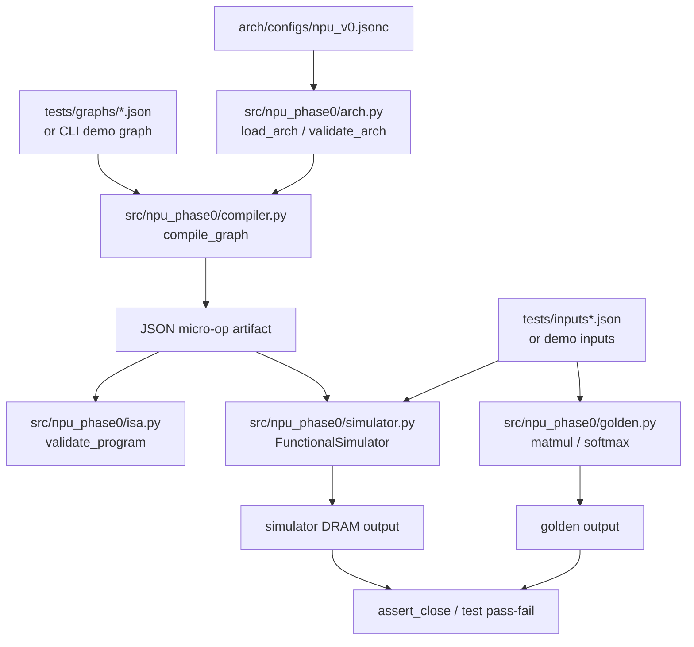
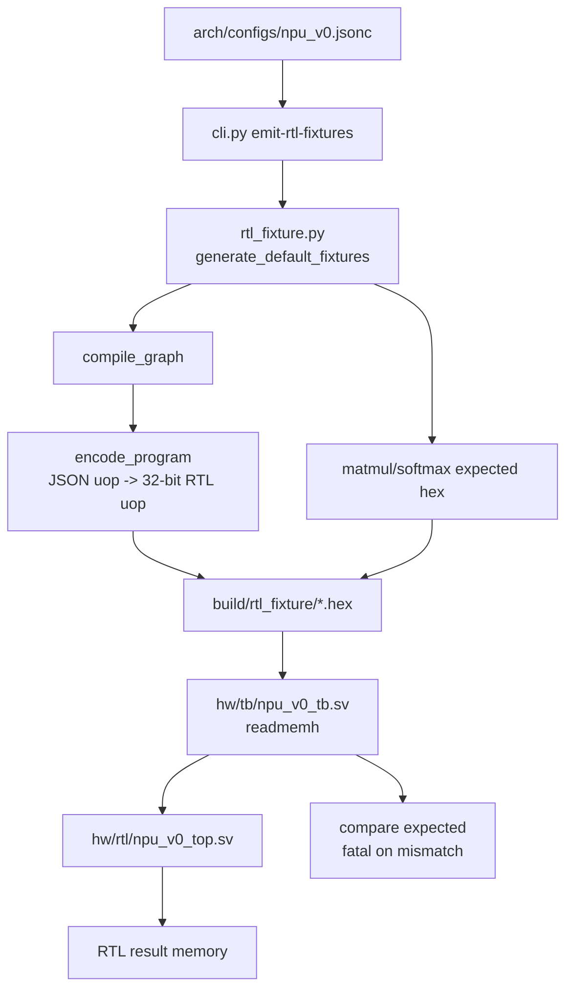

# Code Structure Review

本文档面向代码 review，描述当前仓库的实际代码结构、数据流、验证闭环，以及后续自动生成 NPU 架构/RTL 时各模块应该如何衔接。

## 1. 当前定位

当前项目是一个 Phase 0 NPU 架构设计与验证闭环。核心目标是从一个架构 spec 出发，编译一个小型 graph，生成 micro-op 指令流，用 Python 功能级仿真执行该指令流，并与 CPU golden 结果对比。RTL simulation 目前也已经接入，但 RTL 是手写的最小硬件目标，用于后续 cycle 级验证的早期锚点，还不是从 spec 自动生成的完整 RTL 系统。

当前支持范围：

| 层级 | 当前状态 |
| --- | --- |
| 架构 spec | `arch/configs/npu_v0.jsonc` 是 Phase 0 的 source of truth |
| Graph 输入 | JSON graph，当前支持 `matmul` 和 `softmax` |
| 编译器 | 将 graph lowered 成 JSON micro-op list |
| 功能级仿真 | Python simulator 执行 micro-op，与 golden 对比 |
| RTL 仿真 | Python 生成 deterministic hex fixtures，SystemVerilog testbench 加载后运行 |
| RTL 生成 | 尚未实现自动生成；当前 `hw/rtl/npu_v0_top.sv` 是手写 RTL |
| Cycle 级验证 | RTL simulation 已经可作为后续 cycle 级验证入口，cycle model 尚未独立实现 |

## 2. 顶层目录地图

```text
npu_arch_design/
  arch/
    configs/
      npu_v0.jsonc              # Phase 0 架构配置/source of truth
  src/
    npu_phase0/
      arch.py                   # 加载并校验架构 spec
      compiler.py               # graph -> JSON micro-op artifact
      isa.py                    # micro-op 合法性校验
      simulator.py              # Python 功能级 micro-op simulator
      golden.py                 # CPU golden matmul/softmax 与数值比较
      rtl_fixture.py            # 编译 graph 并生成 RTL testbench 使用的 hex fixtures
      cli.py                    # 命令行入口
  hw/
    rtl/
      npu_v0_top.sv             # 手写 Phase 0 RTL top
      README.md                 # RTL memory map / uop encoding 说明
    tb/
      npu_v0_tb.sv              # SystemVerilog testbench
  tests/
    graphs/
      matmul_softmax.json       # graph 示例
    inputs_matmul_softmax.json  # graph 输入数据
    test_phase0.py              # Python 单元测试
  docs/
    overall_architecture.md     # 目标架构规划
    minimal_closed_loop.md      # 最小闭环定义
    roadmap.md                  # 迭代路线
    code_structure_review.md    # 本文档
  references/                   # 架构参考资料
  scripts/                      # 辅助脚本
  Makefile                      # 常用验证命令
```

## 3. 端到端功能级闭环

当前功能级闭环从 spec 和 graph 开始，到 Python simulator 与 CPU golden 对比结束。



关键点：

- `arch.py` 负责把 JSONC spec 变成 Python dict，并检查必需字段、ISA 指令集合、tile 约束、memory/bus/DMA 参数和 RTL tile 是否一致。
- `compiler.py` 目前是直接 lowering，不做复杂 tiling、memory planning 或调度优化。
- `isa.py` 校验 micro-op 是否属于 spec 中声明的 ISA，并检查 `MATMUL` shape 是否符合 tile multiple 约束。
- `simulator.py` 按 micro-op 顺序解释执行，内部有 `dram`、`buffers`、`scalars` 和 counters。
- `golden.py` 提供 CPU reference。`matmul` 精确比较；`softmax` 当前 Python simulator 使用 `math.exp`/`math.div` 的 fp32 风格计算。

## 4. Spec 如何约束代码

`arch/configs/npu_v0.jsonc` 是 Phase 0 的代码契约。当前它影响以下模块：

| Spec 区域 | 被谁消费 | 当前作用 |
| --- | --- | --- |
| `scope.operators` | `arch.py`, `compiler.py` | 限定 Phase 0 只支持 `matmul` / `softmax` |
| `scope.edge_tiles` | `isa.py` | 禁止 edge tile，要求 matmul shape 是 tile 的整数倍 |
| `isa.instructions` | `arch.py`, `isa.py` | 校验合法 micro-op 集合 |
| `isa.program_format` | `compiler.py` | 写入 compile artifact 的 `format` |
| `compute.array_m/n/k_step` | `arch.py`, `isa.py` | 校验 MAC lanes 和 matmul tile multiple |
| `vector_sfu.lanes` | `arch.py` | 校验向量 SFU 参数存在，目前 simulator 未按 lanes 建模 cycle |
| `memory`, `dma`, `bus` | `arch.py` | 做结构合法性校验，尚未驱动真实 memory allocator 或 DMA lowering |
| `rtl.matmul_tile` | `arch.py` | 确认 RTL demo tile 与 compute tile 一致 |
| `verification.*` | `cli.py`, `tests/test_phase0.py` | 决定 Python softmax tolerance 和 RTL 近似 tolerance |

后续如果真正实现“按 spec 自动生成 NPU 架构及 RTL 逻辑”，应该让 `arch/configs/npu_v0.jsonc` 继续作为唯一入口，然后扩展出：

```text
spec
  -> schema validation
  -> compiler target description
  -> simulator config
  -> RTL generator parameters/templates
  -> runtime memory map
  -> test/fixture generator
  -> PPA/cycle model inputs
```

## 5. Graph 到 Micro-Op

Graph 输入示例在 `tests/graphs/matmul_softmax.json`：

```json
{
  "tensors": {
    "A": {"shape": [8, 8], "dtype": "int8"},
    "B": {"shape": [8, 8], "dtype": "int8"}
  },
  "ops": [
    {"type": "matmul", "a": "A", "b": "B", "out": "C"},
    {"type": "softmax", "x": "C", "out": "Y"}
  ]
}
```

`compile_graph()` 生成的 micro-op 形态大致如下：

```text
LOAD    A -> spad_a
LOAD    B -> spad_b
MATMUL  spad_a, spad_b -> acc_C
STORE   acc_C -> C
LOAD    C -> spad_softmax
VREDMAX spad_softmax -> scalar_max
VSUB    spad_softmax - scalar_max -> spad_softmax
VEXP    spad_softmax -> spad_softmax
VREDSUM spad_softmax -> scalar_sum
VDIV    spad_softmax / scalar_sum -> spad_softmax
STORE   spad_softmax -> Y
HALT
```

当前编译器的重要限制：

- 不做多 tile 分块调度；shape 只被校验为 tile multiple。
- 不做真实 scratchpad allocation；buffer 名称是固定字符串。
- 不做 tensor address assignment；Python simulator 使用 tensor 名称访问 `dram` dict。
- 不生成 RTL binary；RTL fixture 路径会在 `rtl_fixture.py` 中临时编码成 32-bit uop。

## 6. Python Simulator 执行模型

`FunctionalSimulator` 的状态很小：

| 状态 | 作用 |
| --- | --- |
| `dram` | host-visible tensor storage，用 tensor name 索引 |
| `buffers` | scratchpad/accumulator/vector buffer 的抽象模型 |
| `scalars` | `scalar_max` / `scalar_sum` 等 softmax 标量 |
| `counters` | 指令数、DMA 次数、元素数、MAC ops、vector ops |

执行语义：

- `LOAD`: 从 `dram[tensor]` deep-copy 到 `buffers[buffer]`，计一次 DMA。
- `STORE`: 从 `buffers[buffer]` deep-copy 到 `dram[tensor]`，计一次 DMA。
- `MATMUL`: 调用 `golden.matmul()`，结果写入 `buffers[out]`。
- `VREDMAX`/`VSUB`/`VEXP`/`VREDSUM`/`VDIV`: 对二维 row-wise tensor 执行 softmax 分解操作。
- `HALT`: 停止执行。

这个 simulator 是功能级，不是 cycle accurate。它适合证明 compiler lowering 的指令语义正确，但不会证明 DMA/compute overlap、bank conflict、pipeline latency 或 valid/ready 时序。

## 7. RTL Simulation 闭环

RTL simulation 使用 Python 生成 fixture，然后 SystemVerilog testbench 加载 fixture 并检查结果。



相关命令：

```text
make rtl-fixtures
make rtl-sim
```

`make rtl-sim` 做三件事：

1. 运行 Python CLI 生成 `build/rtl_fixture/*.hex`。
2. 用 `iverilog -g2012` 编译 `hw/rtl/npu_v0_top.sv` 和 `hw/tb/npu_v0_tb.sv`。
3. 用 `vvp` 运行 testbench。

当前 RTL 实现范围：

| 文件 | 作用 |
| --- | --- |
| `hw/rtl/npu_v0_top.sv` | 单模块手写 RTL，包含 tiny DRAM、scratchpad、accumulator、vector buffer、uop sequencer |
| `hw/tb/npu_v0_tb.sv` | 加载 Python 生成的 hex fixture，分别跑 matmul 和 softmax |
| `hw/rtl/README.md` | 记录 host memory map、uop encoding、softmax 近似 |

当前 RTL micro-op encoding：

```text
[31:28] opcode
[27:24] arg0
[23:20] arg1
[19:0]  reserved
```

RTL 与 Python simulator 的数值差异：

- Python simulator 的 softmax 使用 `math.exp` 和浮点除法。
- RTL softmax 使用 Q0.8 LUT 近似和整数除法。
- `rtl_fixture.py` 中的 `softmax_q0_8()` 负责生成匹配 RTL 近似语义的 expected output。

## 8. CLI 和 Makefile 入口

| 命令 | 入口 | 作用 |
| --- | --- | --- |
| `make validate-arch` | `npu_phase0.cli validate-arch` | 校验 `arch/configs/npu_v0.jsonc` |
| `make demo` | `npu_phase0.cli demo` | 内置 matmul -> softmax graph，编译、仿真、golden 对比 |
| `make test` | `python -m unittest discover` | 跑 Python 单元测试 |
| `make rtl-fixtures` | `npu_phase0.cli emit-rtl-fixtures` | 生成 RTL hex fixtures |
| `make rtl-sim` | Makefile + iverilog/vvp | 生成 fixture 并跑 RTL simulation |
| `make refresh-references` | `scripts/refresh_references.py` | 刷新参考资料文档 |

## 9. 测试入口和测试数据

当前 Python 测试入口是 `tests/test_phase0.py`，`make test` 会通过下面的命令发现并执行它：

```text
PYTHONPATH=src python -m unittest discover -s tests -v
```

`tests/test_phase0.py` 当前覆盖的主流程：

| 测试 | 验证内容 |
| --- | --- |
| `test_arch_validates` | `arch/configs/npu_v0.jsonc` 能被加载并通过 spec 校验 |
| `test_matmul_golden` | CPU golden `matmul()` 的基础正确性 |
| `test_compile_and_simulate_matmul_softmax` | 内联 graph/input -> compiler -> simulator -> golden softmax 对比 |
| `test_rtl_fixture_generation` | RTL uop encoding、Q0.8 softmax expected、fixture 文件集合 |

测试数据文件状态：

| 文件 | 当前状态 |
| --- | --- |
| `tests/graphs/matmul_softmax.json` | 示例 graph 文件；当前 `test_phase0.py` 没有读取它，而是内联构造了等价 graph |
| `tests/inputs_matmul_softmax.json` | 示例输入数据文件；当前 `test_phase0.py` 没有读取它，而是内联构造输入矩阵 |
| `build/rtl_fixture/*.hex` | 由 `make rtl-fixtures` 或 `make rtl-sim` 生成，供 SystemVerilog testbench `$readmemh` 使用 |

也就是说，你的理解是对的：目前 Python 单元测试里的 matmul-softmax graph 和输入数据是写在 `test_phase0.py` 代码里的，`tests/inputs_matmul_softmax.json` 还没有接入测试入口。这个文件更像是预留的外部测试向量。后续可以把测试改成读取 `tests/graphs/matmul_softmax.json` 和 `tests/inputs_matmul_softmax.json`，这样 CLI demo、unit test、fixture 生成可以共享同一组 case。

RTL 测试入口是 `make rtl-sim`，路径如下：

```text
make rtl-sim
  -> make rtl-fixtures
  -> npu_phase0.cli emit-rtl-fixtures
  -> src/npu_phase0/rtl_fixture.py
  -> build/rtl_fixture/*.hex
  -> iverilog hw/rtl/npu_v0_top.sv hw/tb/npu_v0_tb.sv
  -> vvp build/npu_v0_tb
```

## 10. Review 建议阅读顺序

如果目标是快速理解当前代码，建议按这个顺序 review：

1. `arch/configs/npu_v0.jsonc`：先理解当前硬件/ISA/验证约束。
2. `src/npu_phase0/arch.py`：看 spec 被如何校验。
3. `src/npu_phase0/compiler.py`：看 graph 如何变成 micro-op。
4. `src/npu_phase0/isa.py`：看 micro-op 的合法性边界。
5. `src/npu_phase0/simulator.py` 和 `src/npu_phase0/golden.py`：看功能级执行和 golden 对比。
6. `tests/test_phase0.py`：看当前 Python 验证覆盖了哪些行为。
7. `src/npu_phase0/rtl_fixture.py`：看 Python artifact 如何桥接到 RTL testbench。
8. `hw/rtl/npu_v0_top.sv` 和 `hw/tb/npu_v0_tb.sv`：看当前 cycle/RTL 级验证锚点。
9. `docs/overall_architecture.md` 和 `docs/minimal_closed_loop.md`：对照长期目标和最小闭环定义。

## 11. 当前缺口

这些点是 review 时需要特别注意的边界，不应误认为已经完成：

- RTL 不是自动生成的；当前是手写最小实现。
- compiler 没有真正做 tiling、memory planning、address assignment 或 latency-aware scheduling。
- Python simulator 是 functional simulator，不是 cycle simulator。
- Python softmax 和 RTL softmax 不是同一个数值模型；RTL fixture 单独实现了 Q0.8 近似 expected。
- Runtime/MMIO host driver 还没有独立软件层；RTL testbench 直接操作内部 memory 或简单 host bus。
- spec 中的 memory/DMA/bus 参数目前主要用于校验，还没有完整驱动 RTL generator 或 simulator 时序模型。
- Python functional simulator 与 CPU golden 对比主要验证 compiler lowering 和 micro-op 语义模型的一致性；它不能替代真实 RTL 逻辑验证。

## 12. 后续演进方向

为了把当前 Phase 0 推进到“按 spec 自动生成 NPU 架构及 RTL，并支持功能级和 cycle 级验证”，建议把工作拆成以下主线：

1. 建立正式 schema：让 spec 字段、类型、默认值、版本升级规则可验证。
2. 抽象 compiler artifact：明确 JSON uop、binary uop、tensor layout、memory map、launch metadata 的边界。
3. 引入 memory planner：从 tensor name 访问升级到显式地址、size、alignment、lifetime。
4. 统一 softmax 数值模型：Python simulator、RTL fixture、RTL 实现共享同一 fixed-point 语义。
5. 拆分 RTL：从单文件 top 拆出 sequencer、instruction memory、DMA、scratchpad、matmul engine、vector SFU。
6. 增加 RTL generator：先用模板参数化 tile/memory/uop encoding，再逐步生成模块实例和 package。
7. 增加 cycle model：用 spec 中的 `compute`、`dma`、`bus` 参数估算 cycle，并与 RTL simulation 对齐。
8. 扩展 tests：加入 multi-tile matmul、更多 shape、非法 graph/spec 测试、RTL/Python artifact 一致性测试。
