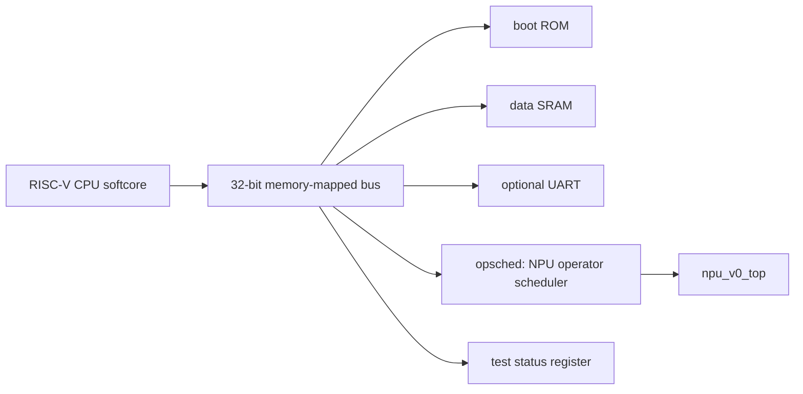

# Minimal SoC Bring-Up Plan

[TOC]

## Table Of Contents

- [Goal](#goal)
- [SoC Architecture](#soc-architecture)
- [Program And Data Flow](#program-and-data-flow)
- [Hardware Components](#hardware-components)
- [Software Components](#software-components)
- [Planned Directory Structure](#planned-directory-structure)
- [Open-Source Reuse Plan](#open-source-reuse-plan)
- [Verification Plan](#verification-plan)
- [Non-Goals For The First SoC](#non-goals-for-the-first-soc)
- [References](#references)

## Goal

中文：

本文档定义 `npu_v0` 周围的最小 SoC 验证平台。目标不是设计复杂 CPU 或完整
应用处理器，而是让软件通过总线和寄存器真实控制 NPU：加载输入 tensor 和
NPU 指令、启动 NPU、轮询完成状态、读取输出并比较结果。

English:

This document defines the minimal SoC verification platform around `npu_v0`.
The goal is not to design a complex CPU or application processor. The goal is
to let software control the NPU through a real bus and memory-mapped registers:
load input tensors and NPU instructions, start the NPU, poll completion, read
outputs, and compare results.

## SoC Architecture



中文：

这张图描述硬件组件和连接关系。CPU 是第一版 SoC 的唯一 bus master；ROM、
SRAM、UART、test status register 和 `opsched` 都是 memory-mapped slave。
`npu_v0_top` 不直接挂到 CPU 总线上，而是通过 `opsched` 暴露软件可见的
控制寄存器、状态寄存器和数据窗口。

`opsched` 这个名字表示 operator scheduler。第一版它的功能很薄：把 CPU 的
MMIO 访问转换成当前 NPU core 的 host interface，并把 `CTRL.start` 写入转换
成一拍 `start` pulse。后续它可以自然演进为更真实的 NPU 作业/算子调度器，
例如维护 command queue、descriptor、interrupt、性能计数器和 DMA 启动逻辑。

English:

This diagram describes the hardware components and their connections. The CPU is
the only bus master in the first SoC. ROM, SRAM, UART, the test status register,
and `opsched` are memory-mapped slaves. `npu_v0_top` is not connected directly
to the CPU bus. Instead, `opsched` exposes software-visible control registers,
status registers, and data windows.

The name `opsched` means operator scheduler. In the first version its function
is intentionally thin: convert CPU MMIO accesses into the current NPU core host
interface and convert a `CTRL.start` write into a one-cycle `start` pulse.
Later, it can evolve into a real NPU job/operator scheduler with command
queues, descriptors, interrupts, performance counters, and DMA launch logic.

## Program And Data Flow


中文：

这张图描述软件和数据流。已有 graph compiler 仍然负责把计算图 lower 成 NPU
micro-op。下一步需要把现在藏在 RTL fixture 里的 32-bit uop 编码逻辑提升成
可复用 assembler。assembler 生成 CPU firmware 可以包含的 C header、仿真可
加载的 MEM/HEX 文件，或后续 runtime 使用的二进制 program blob。

English:

This diagram describes the software and data flow. The existing graph compiler
continues to lower compute graphs into NPU micro-ops. The next step is to
promote the 32-bit uop encoding logic currently embedded in the RTL fixture path
into a reusable assembler. The assembler should generate C headers for CPU
firmware, MEM/HEX files for simulation, and later binary program blobs for a
runtime.

## Hardware Components

中文：

第一版 SoC 的硬件组件必须尽量小。我们只需要足够的 CPU、总线、存储器和
`opsched` 来证明软件控制 NPU 的闭环，不需要 cache、MMU、OS、中断或复杂
interconnect。

English:

The first SoC hardware should be intentionally small. We only need enough CPU,
bus, memory, and `opsched` logic to prove the software-controlled NPU loop. We
do not need cache, MMU, an OS, interrupts, or a complex interconnect.

| Component | Initial specification |
| --- | --- |
| CPU | Existing RV32 softcore, preferably PicoRV32 or equivalent |
| Bus | 32-bit address/data, one outstanding transaction, CPU-only master |
| ROM | 8 KiB to 32 KiB firmware/reset memory |
| SRAM | 32 KiB to 128 KiB data/stack/test memory |
| opsched | MMIO slave exposing NPU control/status registers and data windows |
| NPU core | Current `hw/npu_core/rtl/npu_v0_top.sv` target location |
| UART | Optional debug output |
| Test status | Simple simulation-visible pass/fail register |

### CPU

中文：

CPU 只负责运行 bare-metal firmware 和 NPU driver。第一候选是 PicoRV32，
因为它是小型开源 RISC-V core，并且有简单 native memory interface、
AXI4-Lite master 和 Wishbone master 版本。我们不应该自己实现 CPU。

English:

The CPU only runs bare-metal firmware and the NPU driver. The first candidate is
PicoRV32 because it is a small open-source RISC-V core and provides a simple
native memory interface, an AXI4-Lite master variant, and a Wishbone master
variant. We should not implement our own CPU.

Current implementation note:

- PicoRV32 is vendored under `hw/soc/cpu/third_party/picorv32`.
- `hw/soc/cpu/rtl/picorv32_native_cpu.sv` adapts the PicoRV32 native memory
  interface to the project local bus.
- `hw/soc/rtl/soc_cpu_top.sv` integrates PicoRV32, boot ROM, SRAM, test status,
  `opsched`, and the NPU core.
- `make cpu-soc-sim` runs the firmware-controlled SoC simulation.

Initial CPU requirements:

| Item | Plan |
| --- | --- |
| ISA | RV32I is enough; RV32IM is acceptable if the selected core/toolchain uses it |
| Privilege | Machine-mode only or no privilege model |
| Cache | None |
| MMU | None |
| Interrupts | Not required for the first milestone |
| Firmware | Bare-metal startup plus C `main()` |

### Bus

中文：

第一版 bus 可以是我们自己写的极小 local bus decoder，也可以用 CPU 自带的
AXI4-Lite/Wishbone 接口接一个很薄的 interconnect。推荐先选 PicoRV32 native
interface 或 Wishbone，减少 AXI 细节。这个 bus 第一阶段只有 CPU 一个
master，所以不需要仲裁。

English:

The first bus can be a very small local bus decoder written by us, or a thin
interconnect attached to the CPU's AXI4-Lite/Wishbone interface. Prefer
PicoRV32's native interface or Wishbone first to avoid unnecessary AXI detail.
The first bus has only one master, so no arbitration is needed.

Initial bus requirements:

| Item | Plan |
| --- | --- |
| Data width | 32 bits |
| Address width | 32 bits |
| Masters | CPU only |
| Slaves | ROM, SRAM, opsched, optional UART, test status |
| Ordering | Strict in-order |
| Bursts | None |

### opsched

中文：

`npu_v0_top` 现在有 `start/done` 和简单 host 读写接口。SoC 版本需要新增
`opsched`，把 CPU MMIO 访问转换成当前 NPU host 接口，并用寄存器产生一拍
`start` pulse。这样软件不再依赖 testbench 直接拉 `start`。

English:

`npu_v0_top` currently exposes `start/done` and a simple host read/write
interface. The SoC version needs `opsched` to convert CPU MMIO accesses into
the current NPU host interface and generate a one-cycle `start` pulse from a
register write. Software will no longer depend on the testbench toggling
`start` directly.

Initial register map:

| Offset | Name | Access | Purpose |
| --- | --- | --- | --- |
| `0x000` | `CTRL` | RW | bit 0 write-1-to-start |
| `0x004` | `STATUS` | RO | bit 0 done, bit 1 busy, bit 2 idle |
| `0x008` | `VERSION` | RO | fixed hardware version |
| `0x00c` | `IRQ_ENABLE` | RW | reserved for later interrupt support |
| `0x010` | `IRQ_STATUS` | RW1C | reserved for later interrupt status |

Initial NPU windows:

| Offset range | Purpose |
| --- | --- |
| `0x100` - `0x1ff` | Matrix A |
| `0x200` - `0x2ff` | Matrix B |
| `0x300` - `0x3ff` | Matrix C |
| `0x400` - `0x47f` | Softmax X |
| `0x480` - `0x4ff` | Softmax Y |
| `0x800` - `0x8ff` | NPU instruction memory |

### SoC Address Map

中文：

地址图第一版只需要稳定、简单、便于 firmware 和 testbench 共享。`opsched`
作为普通 MMIO 外设挂在 `0x1000_0000`，NPU core 通过 `opsched` 间接暴露。

English:

The first address map only needs to be stable, simple, and easy to share between
firmware and testbenches. `opsched` appears as a normal MMIO peripheral at
`0x1000_0000`, and the NPU core is indirectly exposed through it.

Current source of truth:

```text
arch/configs/soc_v0.jsonc
```

Generated RTL include:

```text
build/soc/soc_v0_addr.svh
```

| Address range | Target |
| --- | --- |
| `0x0000_0000` - `0x0000_7fff` | Boot ROM / firmware memory |
| `0x0002_0000` - `0x0003_ffff` | SRAM |
| `0x1000_0000` - `0x1000_0fff` | opsched MMIO |
| `0x2000_0000` - `0x2000_0fff` | Optional UART |
| `0x3000_0000` - `0x3000_000f` | Simulation test status |

## Software Components

中文：

软件栈按运行位置和职责分层：`sw/soc_cpu` 放运行在 SoC CPU 上的软件，如
boot code、NPU wrapper driver、runtime 和 firmware tests；`sw/npu_core`
放 NPU core 消费或执行的程序/算子代码；`sw/tools` 放开发主机上运行的工具，
例如 CPU toolchain 集成、NPU graph compiler、NPU assembler、simulator 和
fixture generator。

English:

The software stack is organized by where code runs and what it controls:
`sw/soc_cpu` contains software that runs on the SoC CPU, such as boot code,
NPU-wrapper drivers, runtime code, and firmware tests. `sw/npu_core` contains
programs or operator code consumed by the NPU core. `sw/tools` contains
development-host tools such as CPU toolchain integration, the NPU graph
compiler, NPU assembler, simulators, and fixture generation.

| Component | Status | Goal |
| --- | --- | --- |
| CPU compiler | Use external RISC-V GNU toolchain | Build bare-metal RV32 firmware |
| CPU boot code | New under `sw/soc_cpu/boot` when firmware starts | Set stack, initialize data if needed, call `main()` |
| CPU linker script | Generated as `build/soc/soc_v0.ld` by `make soc-spec` | Match ROM/SRAM address map |
| NPU CPU-side driver | New under `sw/soc_cpu/drivers/npu_wrapper` | Hide opsched MMIO offsets and launch protocol |
| CPU runtime and firmware tests | New under `sw/soc_cpu/runtime` and `sw/soc_cpu/apps` | CPU-controlled matmul/softmax pass/fail tests |
| NPU core programs/operators | New under `sw/npu_core` | Code or program descriptions consumed by the NPU core |
| NPU graph compiler | Host tool under `sw/tools` | Lower graph JSON to NPU operator/uop streams |
| NPU uop assembler | Host tool under `sw/tools` | Encode JSON micro-ops into 32-bit instruction words |
| Golden model and simulator | Host verification tools under `sw/tools` or `test` | Produce expected outputs for firmware and tests |

### CPU Toolchain

中文：

我们可以使用 RISC-V GNU toolchain，而不是自己写 compiler。第一版目标是
bare-metal `rv32`，例如 `rv32i/ilp32` 或 `rv32im/ilp32`。具体命令取决于
本机安装的工具链前缀，常见是 `riscv32-unknown-elf-gcc` 或支持 RV32
multilib 的 `riscv64-unknown-elf-gcc`。

English:

We can use the RISC-V GNU toolchain instead of writing a compiler. The first
target is bare-metal `rv32`, such as `rv32i/ilp32` or `rv32im/ilp32`. The exact
command depends on the installed toolchain prefix, commonly
`riscv32-unknown-elf-gcc` or an RV32-capable multilib
`riscv64-unknown-elf-gcc`.

Current implementation note:

`make firmware-smoke` now prefers the real bare-metal firmware under
`sw/soc_cpu` when `riscv-none-elf-gcc`, `riscv32-unknown-elf-gcc`, or
`riscv64-unknown-elf-gcc` is installed. It compiles with `-march=rv32i
-mabi=ilp32`, links with generated `build/soc/soc_v0.ld`, and converts the ELF
to `build/firmware/soc_cpu_smoke.hex` for `boot_rom`.

If no toolchain is present, the Makefile falls back to
`sw/tools/firmware/emit_soc_cpu_smoke.py`, a temporary RV32I firmware emitter,
so `cpu-soc-sim` remains usable while the toolchain is being installed.

### CPU Boot Code And Firmware

中文：

第一版更准确地说是 boot stub，不是复杂 bootloader。它只需要设置 stack，
必要时初始化 `.bss/.data`，然后进入 C `main()`。firmware 的 `main()` 调用
NPU driver，完成输入加载、program 加载、启动、轮询和结果检查。

English:

The first version is more accurately a boot stub, not a complex bootloader. It
only needs to set the stack, initialize `.bss/.data` if needed, and enter C
`main()`. Firmware `main()` calls the NPU driver to load inputs, load the
program, start execution, poll completion, and check results.

### NPU CPU-Side Driver

中文：

NPU driver 是一个很小的 bare-metal C 库，运行在 CPU 上。它不做复杂 runtime，
只封装 opsched MMIO 读写、program/tensor 加载、启动和超时等待。

English:

The NPU driver is a small bare-metal C library running on the CPU. It is not a
complex runtime. It only wraps opsched MMIO reads/writes, program/tensor
loading, launch, and timeout-based waiting.

Initial API shape:

```c
void npu_write32(uint32_t offset, uint32_t value);
uint32_t npu_read32(uint32_t offset);
void npu_load_program(const uint32_t *program, uint32_t words);
void npu_load_matmul_inputs(const int8_t *a, const int8_t *b, uint32_t elems);
void npu_start(void);
int npu_wait_done(uint32_t timeout_cycles);
void npu_read_matmul_output(int32_t *c, uint32_t elems);
```

### NPU Programs, Operators, Compiler, And Assembler

中文：

严格来说，当前 NPU core 执行的是由 host-side compiler/assembler 生成的
NPU program。目录语义上，`sw/npu_core` 只放 NPU core 消费或执行的程序、
算子描述或后续 NPU-side operator code；graph compiler、micro-op assembler、
simulator 和 fixture generator 都属于开发主机工具，应放在 `sw/tools`。
当前 `sw/tools/npu_phase0/compiler.py` 和 `sw/tools/npu_phase0/rtl_fixture.py`
中的逻辑后续应拆分为更明确的 compiler、assembler、simulator 和 fixture
模块。

English:

Strictly speaking, the current NPU core executes NPU programs generated by
host-side compiler and assembler tools. In this repository, `sw/npu_core`
should only contain programs, operator descriptions, or later NPU-side operator
code consumed by the NPU core. The graph compiler, micro-op assembler,
simulator, and fixture generator are development-host tools and belong under
`sw/tools`. The current `sw/tools/npu_phase0/compiler.py` and
`encode_program()` in `sw/tools/npu_phase0/rtl_fixture.py` should gradually be
split into clearer compiler, assembler, simulator, and fixture modules.

## Planned Directory Structure

中文：

按照你的建议，项目顶层后续收敛为 `sw/hw/docs/test/build`。这个结构也符合
很多 SoC/嵌入式项目的常见分层：硬件设计、运行在 CPU 上的软件、面向加速器
的软件栈、测试和生成产物分开。第三方 IP 和第三方工具只放引用、脚本或
submodule，不把下载生成的大工具链混入核心源码。

English:

Following your suggestion, the top-level project should converge toward
`sw/hw/docs/test/build`. This also matches common SoC/embedded project layering:
hardware design, CPU software, accelerator-facing software stack, tests, and
generated artifacts are separated. Third-party IP and tools should be referenced
through scripts or submodules where appropriate, not mixed into core source code
as downloaded build products.

```text
npu_arch_design/
  docs/
    soc_bringup.md                  # SoC plan
    fpga_bringup.md                 # FPGA-specific bring-up notes
    project_plan.md                 # active milestones and ownership
    collaboration_journal.md        # collaboration decisions and context
    work_rules.md                   # co-work rules
    archive/                        # historical notes

  hw/
    soc/
      rtl/
        soc_top.sv                  # CPU-side bus + memories + wrapper top
        bus/
          simple_bus.sv             # local bus/address decoder
        mem/
          boot_rom.sv               # ROM wrapper
          simple_sram.sv            # SRAM wrapper
        debug/
          test_status.sv            # simulation pass/fail register
          uart_lite.sv              # optional UART
      tb/
        soc_tb.sv                   # full SoC simulation testbench
      cpu/
        third_party/                # CPU IP if vendored/submoduled

    npu_wrapper/
      rtl/
        npu_v0_opsched.sv           # CPU-visible NPU operator scheduler
        npu_v0_regs.svh             # register offsets/fields
      tb/
        npu_v0_opsched_tb.sv        # opsched wrapper tests

    npu_core/
      rtl/
        npu_v0_top.sv               # NPU core RTL
      tb/
        npu_v0_tb.sv                # NPU core tests

  sw/
    soc_cpu/
      boot/
        start.S                     # reset/startup code
      drivers/
        npu_wrapper/
          npu_v0.h                  # opsched register definitions
          npu_v0.c                  # bare-metal NPU driver
      runtime/
        npu_runtime.c               # CPU-side launch/runtime helpers
      apps/
        matmul_smoke/
          main.c                    # CPU-controlled NPU matmul test
        softmax_smoke/
          main.c                    # CPU-controlled NPU softmax test

    npu_core/
      operators/
        matmul/                     # NPU-core consumed operator programs/code
        softmax/
      programs/
        smoke/                      # NPU-core program descriptions

    tools/
      cpu_toolchain/
        riscv_gcc.md                # how to install/select RISC-V GCC
      npu_compiler/                 # graph -> operator/uop stream
      npu_assembler/                # uop stream -> 32-bit uops
      npu_phase0/                   # current compatibility package
      sim/                          # host-side simulators/golden helpers

  test/
    graphs/
      matmul_softmax.json           # graph tests
    inputs/
      matmul_softmax.json           # input tensor tests
    golden/
      golden.py                     # CPU golden/reference model
    fixtures/
      README.md                     # temporary fixture policy
    rtl/
      test_phase0.py                # RTL/compiler integration tests
    soc/
      test_soc_smoke.py             # planned SoC integration tests

  build/
    rtl_fixture/                    # generated RTL fixtures
    firmware/                       # generated ELF/HEX/MEM artifacts
    soc/                            # generated SoC simulation outputs
```

Directory ownership:

| Directory | Contents |
| --- | --- |
| `hw/soc` | CPU subsystem, bus, memories, debug peripherals, SoC top |
| `hw/npu_wrapper` | CPU-visible NPU operator scheduler and register interface |
| `hw/npu_core` | NPU core RTL |
| `sw/soc_cpu` | Software that runs on the embedded CPU |
| `sw/npu_core` | Programs or operator code consumed by the NPU core |
| `sw/tools` | Development-host tools: compilers, assemblers, simulators, fixture generators |
| `test` | Graph tests, golden models, RTL tests, SoC tests |
| `build` | Generated artifacts only |

Migration note:

| Current path | Future target |
| --- | --- |
| `hw/rtl/npu_v0_top.sv` | `hw/npu_core/rtl/npu_v0_top.sv` |
| `hw/tb/npu_v0_tb.sv` | `hw/npu_core/tb/npu_v0_tb.sv` |
| `hw/npu/opsched` | `hw/npu_wrapper/rtl` |
| `src/npu_phase0` | `sw/tools/npu_phase0` compatibility package |
| `tests/graphs` | `test/graphs` |
| `tests/test_phase0.py` | `test/rtl/test_phase0.py` |

## Open-Source Reuse Plan

中文：

CPU 和 CPU compiler 可以直接复用开源项目；小总线可以先自己写，因为第一版
只有 CPU 一个 master，地址 decode 很薄。如果选择 PicoRV32 的 AXI4-Lite 或
Wishbone 版本，也可以复用现成协议接口，但我们仍需要写 SoC 地址 decode、
ROM/SRAM wrapper、opsched、firmware、linker script 和测试。

English:

The CPU and CPU compiler can be reused from open-source projects. The small bus
can be written locally first because the first version has only one CPU master
and a thin address decoder. If we choose PicoRV32's AXI4-Lite or Wishbone
variant, we can reuse an existing protocol interface, but we still need to write
the SoC address decode, ROM/SRAM wrappers, opsched, firmware, linker script,
and tests.

| Piece | Reuse or build | Notes |
| --- | --- | --- |
| CPU core | Reuse | PicoRV32 is the first candidate |
| CPU compiler | Reuse | RISC-V GNU toolchain |
| CPU startup code | Build small local version | Project-specific memory map |
| Linker script | Build local version | Project-specific ROM/SRAM map |
| Local bus/address decode | Build local first | Simpler than importing a full interconnect |
| AXI/Wishbone interconnect | Optional reuse later | Useful when the system grows |
| opsched | Build local version | Specific to `npu_v0_top` and our operator launch protocol |
| NPU driver | Build local version | Specific to our opsched register map |
| Uop assembler | Refactor/build local version | Based on existing `rtl_fixture.py` encoding |

## Verification Plan

中文：

验证顺序必须从小到大。先证明 opsched 可以用寄存器启动 NPU，再接 CPU；先跑
matmul，再跑 softmax；先用 polling，再考虑 interrupt；先仿真，再考虑 FPGA。

English:

Verification must progress from small to large. First prove that opsched can
start the NPU through registers, then connect the CPU. Run matmul before
softmax. Use polling before interrupts. Simulate before attempting FPGA
bring-up.

Milestones:

| Milestone | Exit condition |
| --- | --- |
| opsched test | Testbench launches NPU by writing `CTRL.start` |
| Assembler artifact | Firmware/testbench use the same encoded NPU program |
| CPU SoC matmul | Firmware boots, starts NPU matmul, reports pass |
| CPU SoC softmax | Firmware starts NPU softmax, reports pass |
| Compiler-fed firmware | Graph compiler output becomes firmware-visible program data |
| FPGA candidate | SoC top is synthesis-clean for a selected board |

## Non-Goals For The First SoC

中文：

第一版明确不做这些事情：自研 CPU、操作系统、cache、MMU、复杂 AXI 系统、
中断优先的 runtime、DMA、多 master 仲裁、CNN/MNIST 端到端测试。CNN/MNIST
是后续目标，应该建立在 matmul/softmax 的 SoC 控制闭环稳定之后。

English:

The first version explicitly does not include a custom CPU, operating system,
cache, MMU, complex AXI system, interrupt-first runtime, DMA, multi-master
arbitration, or end-to-end CNN/MNIST tests. CNN/MNIST is a later target and
should build on a stable SoC control loop for matmul and softmax.

## References

中文：

这些项目的分层方式对我们的目录结构有参考价值：LiteX 把 SoC 集成、CSR/bus
和软件访问头文件作为明确边界；Zephyr 把架构、SoC、driver、test 分层；
Chipyard 强调硬件生成、软件 RTL 仿真和测试芯片 IP 的分离。

English:

These projects are useful references for our structure: LiteX makes SoC
integration, CSR/bus logic, and software access headers explicit boundaries;
Zephyr separates architecture, SoC, drivers, and tests; Chipyard separates
hardware generation, software RTL simulation, and test-chip IP.

- PicoRV32: https://github.com/YosysHQ/picorv32
- RISC-V GNU toolchain: https://github.com/riscv-collab/riscv-gnu-toolchain
- LiteX CSR bus notes: https://github.com/enjoy-digital/litex/wiki/CSR-Bus
- Zephyr source tree notes: https://docs.zephyrproject.org/latest/develop/application/index.html
- Chipyard documentation: https://chipyard.readthedocs.io/
